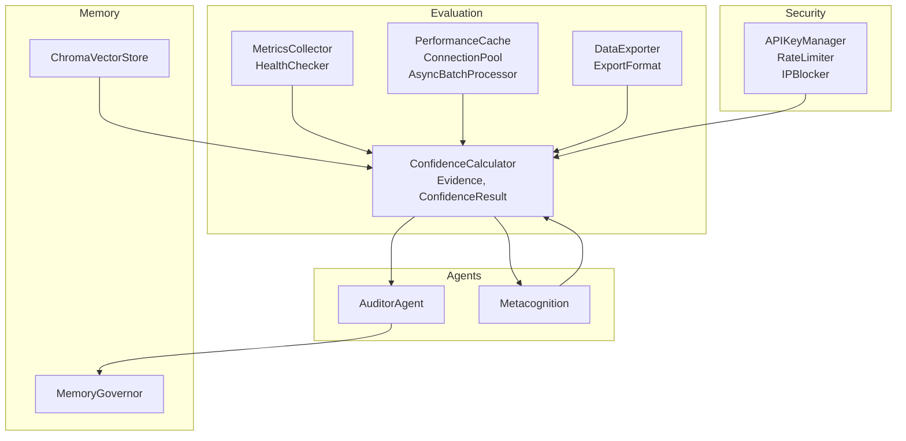
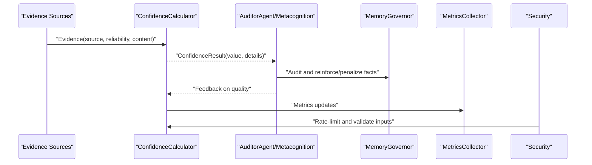
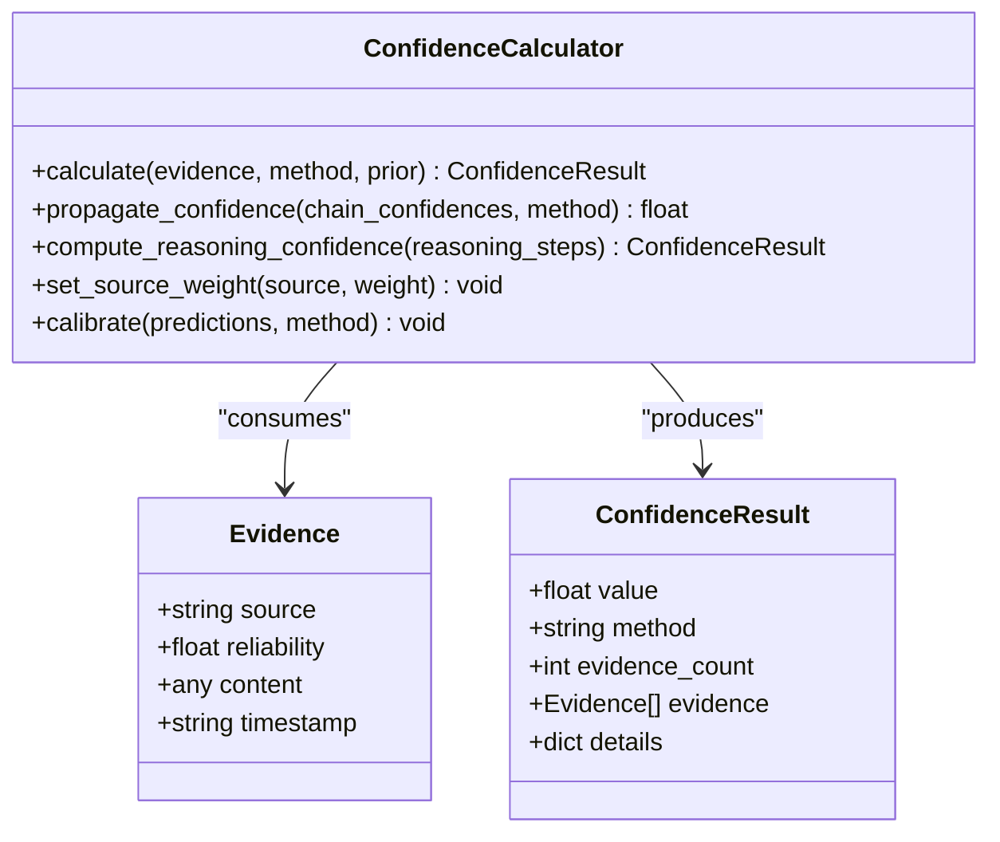
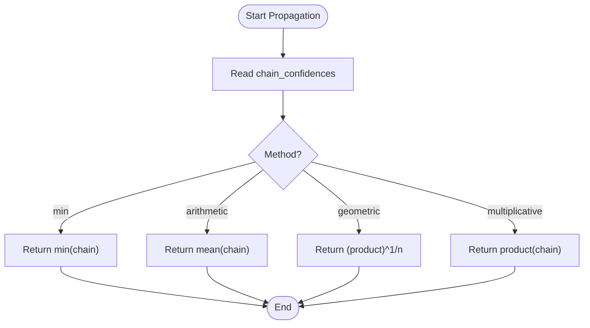
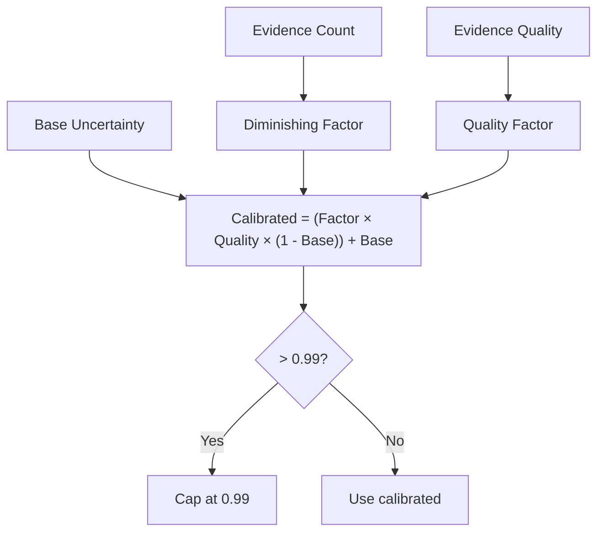
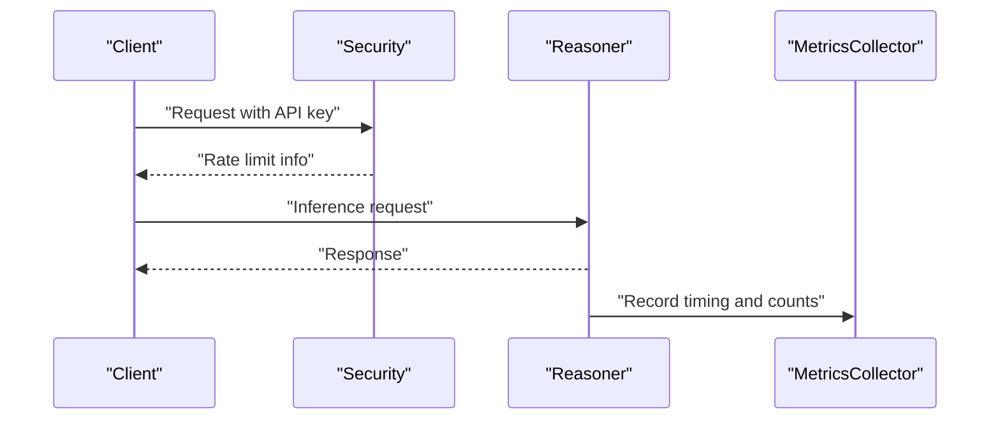
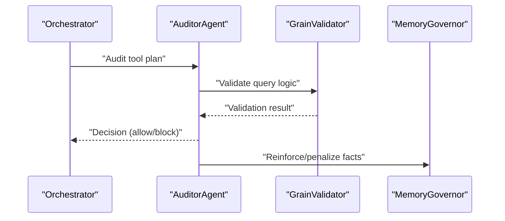
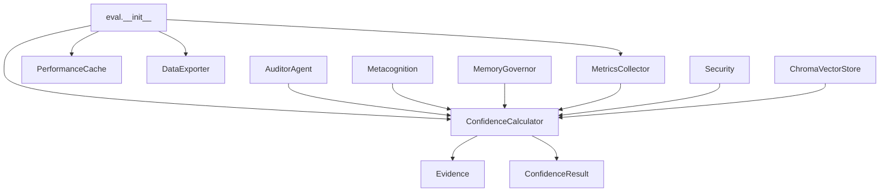

# Evidence Propagation and Quality Assurance

<cite>
**Referenced Files in This Document**
- [confidence.py](file://src/eval/confidence.py)
- [monitoring.py](file://src/eval/monitoring.py)
- [performance.py](file://src/eval/performance.py)
- [export.py](file://src/eval/export.py)
- [__init__.py](file://src/eval/__init__.py)
- [demo_confidence_reasoning.py](file://examples/demo_confidence_reasoning.py)
- [test_evidence.py](file://tests/test_evidence.py)
- [security.py](file://src/core/security.py)
- [metacognition.py](file://src/agents/metacognition.py)
- [auditor.py](file://src/agents/auditor.py)
- [vector_adapter.py](file://src/memory/vector_adapter.py)
- [governance.py](file://src/memory/governance.py)
- [ontology-validate.yml](file://.github/workflows/ontology-validate.yml)
- [TWITTER_THREADS.md](file://docs/marketing/TWITTER_THREADS.md)
</cite>

## Table of Contents
1. [Introduction](#introduction)
2. [Project Structure](#project-structure)
3. [Core Components](#core-components)
4. [Architecture Overview](#architecture-overview)
5. [Detailed Component Analysis](#detailed-component-analysis)
6. [Dependency Analysis](#dependency-analysis)
7. [Performance Considerations](#performance-considerations)
8. [Troubleshooting Guide](#troubleshooting-guide)
9. [Conclusion](#conclusion)
10. [Appendices](#appendices)

## Introduction
This document explains the evidence propagation and quality assurance systems that underpin traceability and validation workflows in the platform. It covers:
- Evidence chain tracking and confidence score propagation
- Quality metric computation and thresholding
- Integration between evaluation systems and safety mechanisms for continuous monitoring
- Examples of evidence collection, propagation algorithms, and quality assessment criteria
- Relationship between evidence strength and safety thresholds
- Automated quality assurance processes
- Performance impact of extensive evidence tracking and optimization strategies for large-scale knowledge graphs
- Guidance on configuring quality thresholds and interpreting validation results

## Project Structure
The evidence and quality assurance capabilities are primarily implemented in the evaluation module and integrated with agents, security, and memory subsystems. Key areas:
- Evaluation: confidence calculation, monitoring, performance optimization, and export
- Agents: auditing and metacognition for safety and quality checks
- Security: API key management, rate limiting, and input validation
- Memory: vector store and governance for long-term quality maintenance

**Diagram sources**
- [confidence.py:32-407](file://src/eval/confidence.py#L32-L407)
- [monitoring.py:20-356](file://src/eval/monitoring.py#L20-L356)
- [performance.py:25-538](file://src/eval/performance.py#L25-L538)
- [export.py:38-312](file://src/eval/export.py#L38-L312)
- [auditor.py:8-72](file://src/agents/auditor.py#L8-L72)
- [metacognition.py:146-203](file://src/agents/metacognition.py#L146-L203)
- [security.py:21-429](file://src/core/security.py#L21-L429)
- [vector_adapter.py:19-97](file://src/memory/vector_adapter.py#L19-L97)
- [governance.py:6-62](file://src/memory/governance.py#L6-L62)

**Section sources**
- [__init__.py:1-12](file://src/eval/__init__.py#L1-L12)

## Core Components
- ConfidenceCalculator: Computes confidence from evidence using multiple methods (weighted, Bayesian, multiplicative, Dempster–Shafer), propagates confidence along reasoning chains, and supports source weighting and calibration.
- Evidence and ConfidenceResult: Data structures representing raw evidence and computed confidence outcomes.
- MetricsCollector and HealthChecker: Continuous monitoring and health checks for runtime quality.
- PerformanceCache, ConnectionPool, AsyncBatchProcessor: Performance optimization primitives for large-scale knowledge graphs.
- DataExporter: Export of validated knowledge with confidence and source metadata.
- AuditorAgent and Metacognition: Safety and quality assurance via auditing and reflective checks.
- MemoryGovernor and ChromaVectorStore: Long-term quality maintenance and scalable retrieval.
- Security primitives: API key management, rate limiting, and input validation to protect quality workflows.

**Section sources**
- [confidence.py:13-407](file://src/eval/confidence.py#L13-L407)
- [monitoring.py:20-356](file://src/eval/monitoring.py#L20-L356)
- [performance.py:25-538](file://src/eval/performance.py#L25-L538)
- [export.py:20-312](file://src/eval/export.py#L20-L312)
- [auditor.py:8-72](file://src/agents/auditor.py#L8-L72)
- [metacognition.py:146-203](file://src/agents/metacognition.py#L146-L203)
- [governance.py:6-62](file://src/memory/governance.py#L6-L62)
- [vector_adapter.py:19-97](file://src/memory/vector_adapter.py#L19-L97)
- [security.py:21-429](file://src/core/security.py#L21-L429)

## Architecture Overview
The system integrates evidence collection, confidence propagation, safety checks, and continuous monitoring. Evidence flows from sources into the confidence calculator, which produces confidence scores used by agents and exporters. Safety mechanisms guard against unsafe or low-quality inferences, while performance tools scale operations for large knowledge graphs.

**Diagram sources**
- [confidence.py:63-118](file://src/eval/confidence.py#L63-L118)
- [auditor.py:24-65](file://src/agents/auditor.py#L24-L65)
- [metacognition.py:146-203](file://src/agents/metacognition.py#L146-L203)
- [governance.py:20-46](file://src/memory/governance.py#L20-L46)
- [monitoring.py:118-167](file://src/eval/monitoring.py#L118-L167)
- [security.py:98-157](file://src/core/security.py#L98-L157)

## Detailed Component Analysis

### Evidence Collection and Confidence Computation
- Evidence model: Each piece carries source, reliability, and content with optional timestamp.
- Methods:
  - Weighted average: Evidence reliability weighted by configurable source weights.
  - Bayesian: Updates belief using likelihood ratios with a prior.
  - Multiplicative: Combines evidence using product of uncertainties.
  - Dempster–Shafer: Belief assignment and mass combination for uncertainty.
- Propagation: Supports min, arithmetic mean, geometric mean, and multiplicative propagation along reasoning chains.
- Calibration: Placeholder support for Platt/isotonic calibration.

**Diagram sources**
- [confidence.py:13-118](file://src/eval/confidence.py#L13-L118)
- [confidence.py:222-297](file://src/eval/confidence.py#L222-L297)

**Section sources**
- [confidence.py:63-118](file://src/eval/confidence.py#L63-L118)
- [confidence.py:120-170](file://src/eval/confidence.py#L120-L170)
- [confidence.py:172-220](file://src/eval/confidence.py#L172-L220)
- [confidence.py:222-297](file://src/eval/confidence.py#L222-L297)
- [demo_confidence_reasoning.py:22-90](file://examples/demo_confidence_reasoning.py#L22-L90)

### Evidence Propagation Algorithms
- Chain propagation supports conservative (min) and averaging strategies.
- Reasoning confidence aggregates per-step confidence derived from premise and rule strengths.

**Diagram sources**
- [confidence.py:222-259](file://src/eval/confidence.py#L222-L259)

**Section sources**
- [confidence.py:222-259](file://src/eval/confidence.py#L222-L259)
- [confidence.py:261-297](file://src/eval/confidence.py#L261-L297)

### Quality Metric Computation and Thresholding
- Quality levels and thresholds:
  - CONFIRMED: 0.8–1.0
  - ASSUMED: 0.5–0.8
  - SPECULATIVE: 0.0–0.5
- Metacognition calibrates confidence based on evidence count and quality with diminishing returns and base uncertainty.
- Tests validate multi-source confidence increases and source weight adjustments.

**Diagram sources**
- [metacognition.py:175-203](file://src/agents/metacognition.py#L175-L203)
- [TWITTER_THREADS.md:129-151](file://docs/marketing/TWITTER_THREADS.md#L129-L151)

**Section sources**
- [metacognition.py:146-203](file://src/agents/metacognition.py#L146-L203)
- [test_evidence.py:12-27](file://tests/test_evidence.py#L12-L27)
- [test_evidence.py:30-45](file://tests/test_evidence.py#L30-L45)
- [test_evidence.py:48-67](file://tests/test_evidence.py#L48-L67)
- [TWITTER_THREADS.md:129-151](file://docs/marketing/TWITTER_THREADS.md#L129-L151)

### Safety Mechanisms and Continuous Monitoring
- API key management, rate limiting, and IP blocking protect system integrity.
- Health checks aggregate component statuses and report overall health.
- MetricsCollector exposes counters, gauges, and histograms for observability.
- Security headers and input validation mitigate injection risks.

**Diagram sources**
- [security.py:21-157](file://src/core/security.py#L21-L157)
- [monitoring.py:118-167](file://src/eval/monitoring.py#L118-L167)
- [monitoring.py:180-216](file://src/eval/monitoring.py#L180-L216)

**Section sources**
- [security.py:21-157](file://src/core/security.py#L21-L157)
- [monitoring.py:20-110](file://src/eval/monitoring.py#L20-L110)
- [monitoring.py:180-216](file://src/eval/monitoring.py#L180-L216)

### Automated Quality Assurance Processes
- AuditorAgent audits tool plans (e.g., graph queries) for cardinality and aggregation risks, returning PASS/FAIL with corrective suggestions.
- Metacognition reflects on reasoning steps, flags low-confidence steps, and detects contradictions.
- MemoryGovernor enforces synaptic pruning and confidence decay to maintain quality over time.

**Diagram sources**
- [auditor.py:24-65](file://src/agents/auditor.py#L24-L65)
- [governance.py:20-46](file://src/memory/governance.py#L20-L46)

**Section sources**
- [auditor.py:8-72](file://src/agents/auditor.py#L8-L72)
- [metacognition.py:46-81](file://src/agents/metacognition.py#L46-L81)
- [governance.py:6-62](file://src/memory/governance.py#L6-L62)

### Export and Traceability
- DataExporter supports exporting triples and entities in JSON, CSV, Turtle, and JSON-LD, preserving confidence and source metadata for traceability.

**Section sources**
- [export.py:45-120](file://src/eval/export.py#L45-L120)
- [export.py:121-224](file://src/eval/export.py#L121-L224)

### Ontology Validation Pipeline
- GitHub Actions workflow validates OWL/RDF syntax on change and can integrate competency question checks.

**Section sources**
- [.github/workflows/ontology-validate.yml:1-68](file://.github/workflows/ontology-validate.yml#L1-L68)

## Dependency Analysis
The evaluation module exports core classes for external use. ConfidenceCalculator depends on Evidence and ConfidenceResult. Monitoring and performance modules are standalone but integrated via decorators and global instances. Agents depend on evaluation and memory modules for quality assurance.

**Diagram sources**
- [__init__.py:1-12](file://src/eval/__init__.py#L1-L12)
- [confidence.py:32-407](file://src/eval/confidence.py#L32-L407)
- [monitoring.py:20-110](file://src/eval/monitoring.py#L20-L110)
- [performance.py:25-104](file://src/eval/performance.py#L25-L104)
- [export.py:38-74](file://src/eval/export.py#L38-L74)
- [auditor.py:17-22](file://src/agents/auditor.py#L17-L22)
- [metacognition.py:146-203](file://src/agents/metacognition.py#L146-L203)
- [governance.py:13-18](file://src/memory/governance.py#L13-L18)
- [vector_adapter.py:31-61](file://src/memory/vector_adapter.py#L31-L61)

**Section sources**
- [__init__.py:1-12](file://src/eval/__init__.py#L1-L12)

## Performance Considerations
- Caching: LRU cache with TTL for inference results and query optimization cache.
- Connection pooling: Configurable pool sizes and timeouts for database/network operations.
- Asynchronous batching: Limits concurrency and processes items in batches to reduce overhead.
- Vector retrieval: ChromaDB integration for scalable semantic similarity search.
- Garbage collection: MemoryGovernor periodically prunes low-confidence facts to keep the knowledge graph lean.

Optimization strategies for large-scale knowledge graphs:
- Enable caching and tune TTL to balance freshness and latency.
- Use batch processing for bulk operations.
- Employ connection pools and asynchronous utilities for throughput.
- Apply vector indexing and hybrid retrieval patterns.
- Periodic garbage collection to remove stale or conflicting knowledge.

**Section sources**
- [performance.py:25-104](file://src/eval/performance.py#L25-L104)
- [performance.py:172-263](file://src/eval/performance.py#L172-L263)
- [performance.py:290-321](file://src/eval/performance.py#L290-L321)
- [vector_adapter.py:31-97](file://src/memory/vector_adapter.py#L31-L97)
- [governance.py:47-62](file://src/memory/governance.py#L47-L62)

## Troubleshooting Guide
Common issues and resolutions:
- Low confidence results:
  - Increase evidence count and improve source reliability.
  - Adjust source weights to emphasize trusted sources.
  - Use Bayesian or Dempster–Shafer methods for nuanced uncertainty modeling.
- Contradictory evidence:
  - Investigate conflicting sources and reconcile differences.
  - Reduce confidence thresholds for conflicting chains.
- Performance bottlenecks:
  - Enable caching and tune TTL.
  - Use asynchronous batching and connection pooling.
  - Optimize queries and avoid broad scans.
- Safety violations:
  - Review API key policies and rate limits.
  - Validate inputs and sanitize queries.
  - Enforce security headers and CORS configuration.

Validation and testing:
- Unit tests verify source weight effects, multi-source confidence, and confidence level thresholds.
- Demonstrations show practical scenarios for supplier evaluation and auto-learning feedback loops.

**Section sources**
- [test_evidence.py:12-27](file://tests/test_evidence.py#L12-L27)
- [test_evidence.py:30-45](file://tests/test_evidence.py#L30-L45)
- [test_evidence.py:48-67](file://tests/test_evidence.py#L48-L67)
- [demo_confidence_reasoning.py:57-122](file://examples/demo_confidence_reasoning.py#L57-L122)
- [security.py:236-320](file://src/core/security.py#L236-L320)

## Conclusion
The platform’s evidence propagation and quality assurance system combines robust confidence computation, safety mechanisms, and continuous monitoring to ensure traceable, validated, and scalable reasoning. By integrating auditing, metacognition, governance, and performance tools, it maintains high-quality outputs even as knowledge graphs grow. Configurable thresholds and automated processes enable reliable operations across diverse domains.

## Appendices

### Configuration and Threshold Guidance
- Confidence levels:
  - CONFIRMED: Use when evidence is strong and corroborated.
  - ASSUMED: Acceptable for single-source or preliminary insights.
  - SPECULATIVE: Flag for insufficient or ambiguous evidence.
- Source weights:
  - Increase weights for trusted sources; decrease for unreliable ones.
- Propagation method:
  - Prefer min for conservative reasoning chains.
  - Use arithmetic mean for balanced propagation.
- Safety thresholds:
  - Enforce circuit breakers and dynamic sentinels to prevent unsafe inferences.
  - Apply rate limits and input validation to protect system integrity.

Interpreting validation results:
- Exported artifacts include confidence and source metadata for traceability.
- Health checks and metrics provide operational visibility.
- Automated audits flag risks and suggest corrective actions.

**Section sources**
- [TWITTER_THREADS.md:129-151](file://docs/marketing/TWITTER_THREADS.md#L129-L151)
- [confidence.py:222-259](file://src/eval/confidence.py#L222-L259)
- [monitoring.py:180-216](file://src/eval/monitoring.py#L180-L216)
- [export.py:121-224](file://src/eval/export.py#L121-L224)
- [auditor.py:24-65](file://src/agents/auditor.py#L24-L65)