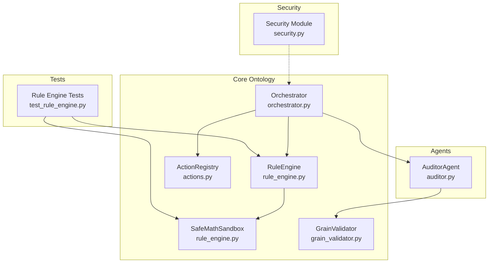
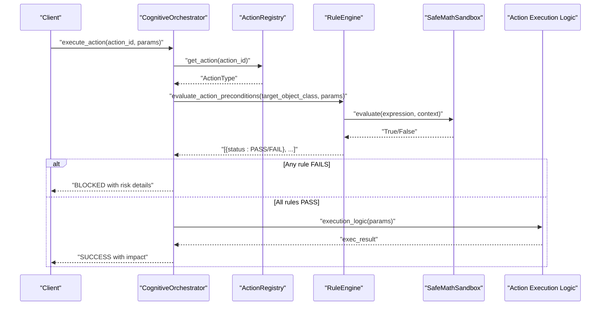
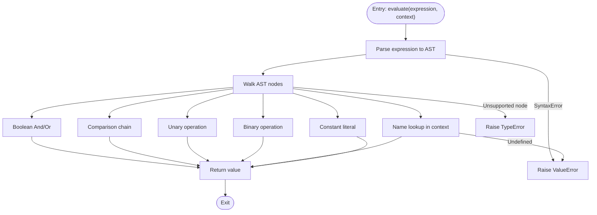
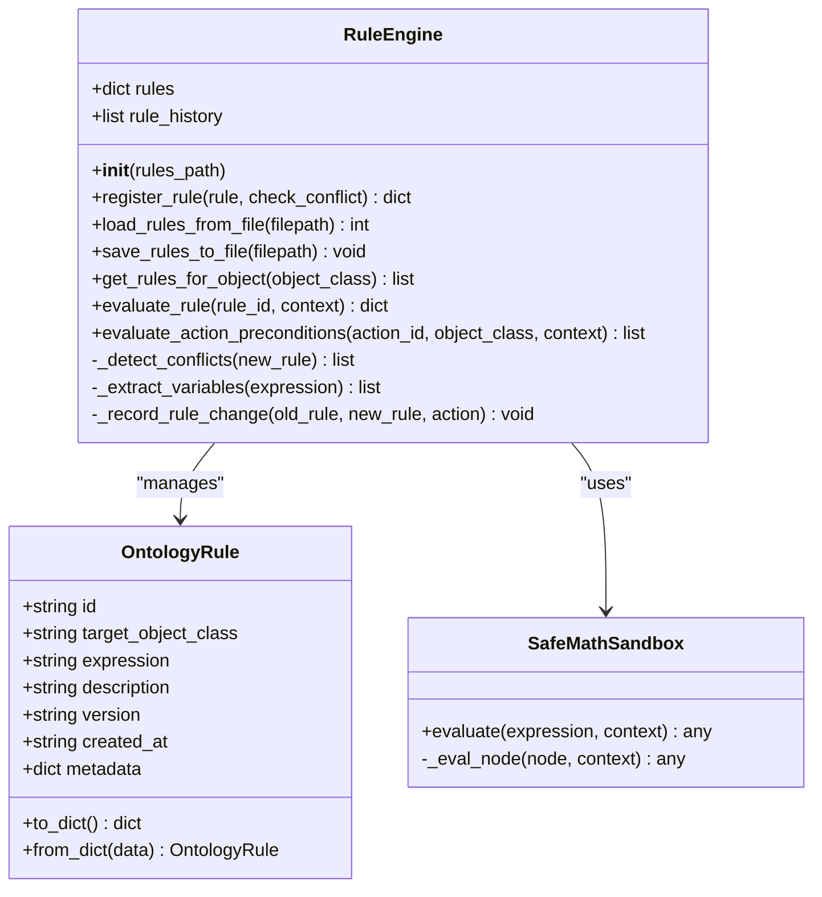
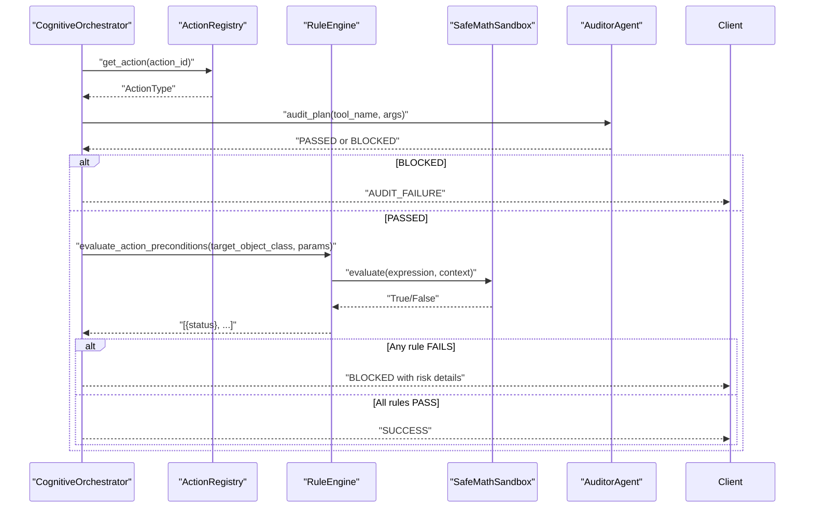
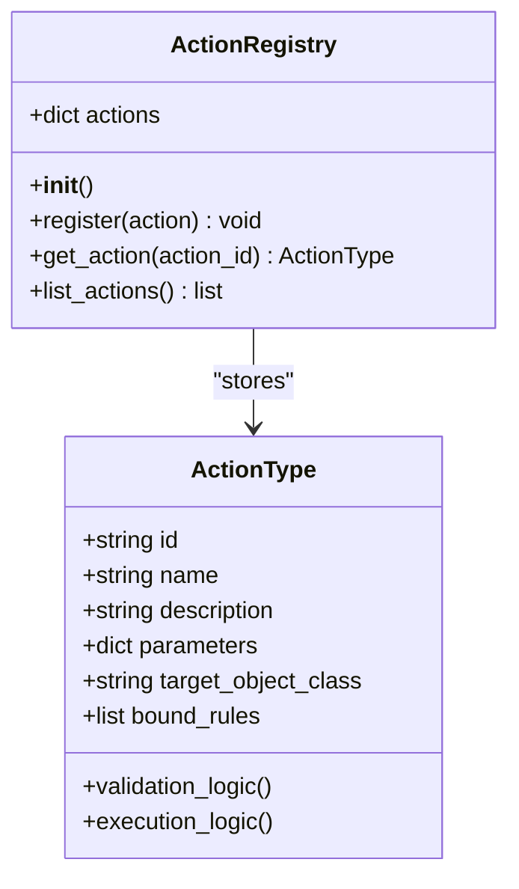
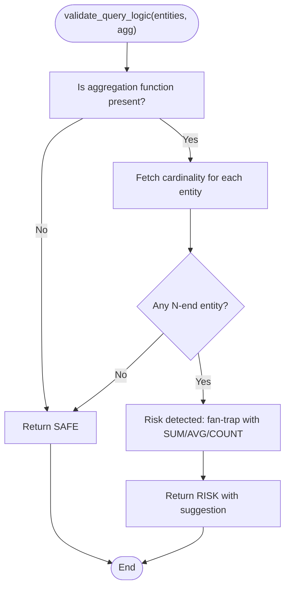
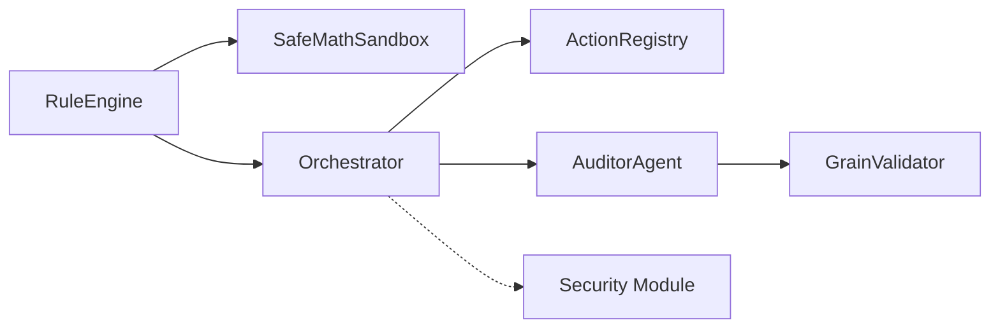

# Rule Engine and Mathematical Sandbox

<cite>
**Referenced Files in This Document**
- [rule_engine.py](file://src/core/ontology/rule_engine.py)
- [security.py](file://src/core/security.py)
- [orchestrator.py](file://src/agents/orchestrator.py)
- [auditor.py](file://src/agents/auditor.py)
- [actions.py](file://src/core/ontology/actions.py)
- [grain_validator.py](file://src/core/ontology/grain_validator.py)
- [test_rule_engine.py](file://tests/test_rule_engine.py)
- [supply_chain.yaml](file://memory/ontology-clawra/supply_chain.yaml)
- [config.yaml](file://ontology-platform/config.yaml)
</cite>

## Table of Contents
1. [Introduction](#introduction)
2. [Project Structure](#project-structure)
3. [Core Components](#core-components)
4. [Architecture Overview](#architecture-overview)
5. [Detailed Component Analysis](#detailed-component-analysis)
6. [Dependency Analysis](#dependency-analysis)
7. [Performance Considerations](#performance-considerations)
8. [Troubleshooting Guide](#troubleshooting-guide)
9. [Conclusion](#conclusion)
10. [Appendices](#appendices)

## Introduction
This document explains the rule engine and mathematical sandbox system that enforces AST-level safety for dynamic rule evaluation. It covers:
- Rule compilation and syntax validation
- Execution environment isolation via a sandbox
- Mathematical constraint enforcement and audit integration
- Orchestration flow control and decision auditing
- Complexity vs. safety trade-offs and performance implications
- Troubleshooting guidance for rule compilation and execution failures

## Project Structure
The rule engine and sandbox live under the core ontology module and integrate with the orchestrator and security subsystems. Tests validate sandbox behavior and rule engine capabilities.

**Diagram sources**
- [rule_engine.py:124-330](file://src/core/ontology/rule_engine.py#L124-L330)
- [orchestrator.py:23-42](file://src/agents/orchestrator.py#L23-L42)
- [auditor.py:8-23](file://src/agents/auditor.py#L8-L23)
- [actions.py:24-70](file://src/core/ontology/actions.py#L24-L70)
- [grain_validator.py:13-55](file://src/core/ontology/grain_validator.py#L13-L55)
- [security.py:19-429](file://src/core/security.py#L19-L429)
- [test_rule_engine.py:12-296](file://tests/test_rule_engine.py#L12-L296)

**Section sources**
- [rule_engine.py:124-330](file://src/core/ontology/rule_engine.py#L124-L330)
- [orchestrator.py:23-42](file://src/agents/orchestrator.py#L23-L42)
- [auditor.py:8-23](file://src/agents/auditor.py#L8-L23)
- [actions.py:24-70](file://src/core/ontology/actions.py#L24-L70)
- [grain_validator.py:13-55](file://src/core/ontology/grain_validator.py#L13-L55)
- [security.py:19-429](file://src/core/security.py#L19-L429)
- [test_rule_engine.py:12-296](file://tests/test_rule_engine.py#L12-L296)

## Core Components
- SafeMathSandbox: AST-based evaluator that safely executes mathematical/logical expressions with strict operator/function whitelists.
- OntologyRule: Serializable rule dataclass with metadata and versioning.
- RuleEngine: Manages rule registration, conflict detection, persistence, and evaluation against runtime contexts.
- Orchestrator: Integrates rule gating into action execution and records audit traces.
- ActionRegistry: Declares actions with target object classes and bound rules for automatic gating.
- GrainValidator: Validates query logic against semantic grain/cardinality to prevent fan-trap risks (complementary to mathematical sandbox).
- Security Module: Provides API key management, rate limiting, and audit logging (supports orchestration-level security).

**Section sources**
- [rule_engine.py:14-86](file://src/core/ontology/rule_engine.py#L14-L86)
- [rule_engine.py:88-123](file://src/core/ontology/rule_engine.py#L88-L123)
- [rule_engine.py:124-330](file://src/core/ontology/rule_engine.py#L124-L330)
- [orchestrator.py:301-337](file://src/agents/orchestrator.py#L301-L337)
- [actions.py:7-23](file://src/core/ontology/actions.py#L7-L23)
- [grain_validator.py:13-55](file://src/core/ontology/grain_validator.py#L13-L55)
- [security.py:19-429](file://src/core/security.py#L19-L429)

## Architecture Overview
The system enforces deterministic mathematical validation before any physical action is executed. The orchestrator gates actions through the rule engine, which evaluates rules in a sandboxed AST environment. Complementary to this, the auditor validates semantic grain/cardinality to prevent logical pitfalls.

**Diagram sources**
- [orchestrator.py:301-337](file://src/agents/orchestrator.py#L301-L337)
- [rule_engine.py:320-330](file://src/core/ontology/rule_engine.py#L320-L330)
- [rule_engine.py:303-318](file://src/core/ontology/rule_engine.py#L303-L318)
- [rule_engine.py:32-56](file://src/core/ontology/rule_engine.py#L32-L56)

## Detailed Component Analysis

### SafeMathSandbox
- Purpose: Safely evaluate mathematical/logical expressions by parsing into an AST and walking only allowed nodes/operators/functions.
- Allowed operators: arithmetic, comparison, logical, unary negation, boolean operations.
- Allowed functions: absolute value, min, max, round, sum, length.
- Safety: Raises explicit errors for unsupported nodes (e.g., lambda) and undefined variables; logs syntax and evaluation errors.

**Diagram sources**
- [rule_engine.py:32-85](file://src/core/ontology/rule_engine.py#L32-L85)

**Section sources**
- [rule_engine.py:14-86](file://src/core/ontology/rule_engine.py#L14-L86)
- [test_rule_engine.py:12-75](file://tests/test_rule_engine.py#L12-L75)

### OntologyRule and RuleEngine
- OntologyRule: Encapsulates rule identity, target object class, expression, description, versioning, timestamps, and metadata; supports serialization/deserialization.
- RuleEngine:
  - Registers rules with optional conflict detection across shared variables on the same target class.
  - Loads/saves rules from YAML/JSON with audit trail recording updates and creates.
  - Evaluates a single rule given a context and returns PASS/FAIL/ERROR with details.
  - Evaluates all rules bound to an object class for an action (precondition gating).

**Diagram sources**
- [rule_engine.py:88-123](file://src/core/ontology/rule_engine.py#L88-L123)
- [rule_engine.py:124-330](file://src/core/ontology/rule_engine.py#L124-L330)
- [rule_engine.py:14-86](file://src/core/ontology/rule_engine.py#L14-L86)

**Section sources**
- [rule_engine.py:88-123](file://src/core/ontology/rule_engine.py#L88-L123)
- [rule_engine.py:124-330](file://src/core/ontology/rule_engine.py#L124-L330)
- [test_rule_engine.py:77-111](file://tests/test_rule_engine.py#L77-L111)

### Orchestrator Integration and Decision Auditing
- The orchestrator wires rule gating into action execution. If any rule bound to the action’s target object class fails, the action is blocked and risks are summarized for the trace.
- The orchestrator also integrates with the auditor for semantic grain validation and maintains a trace of tool calls, latency, and outcomes.

**Diagram sources**
- [orchestrator.py:301-337](file://src/agents/orchestrator.py#L301-L337)
- [auditor.py:24-65](file://src/agents/auditor.py#L24-L65)
- [rule_engine.py:320-330](file://src/core/ontology/rule_engine.py#L320-L330)
- [rule_engine.py:303-318](file://src/core/ontology/rule_engine.py#L303-L318)

**Section sources**
- [orchestrator.py:301-337](file://src/agents/orchestrator.py#L301-L337)
- [auditor.py:24-65](file://src/agents/auditor.py#L24-L65)

### Action Registry and Bound Rules
- Action types declare target object classes and bound rule IDs. During execution, the orchestrator retrieves all rules for the target class and evaluates them against the action parameters.

**Diagram sources**
- [actions.py:7-23](file://src/core/ontology/actions.py#L7-L23)
- [actions.py:24-70](file://src/core/ontology/actions.py#L24-L70)

**Section sources**
- [actions.py:7-23](file://src/core/ontology/actions.py#L7-L23)
- [actions.py:24-70](file://src/core/ontology/actions.py#L24-L70)

### Grain Validator (Complementary Semantic Gate)
- Validates whether a query involving aggregation functions is consistent with the semantic grain/cardinality to prevent fan-trap risks. Used by the auditor during plan auditing.

**Diagram sources**
- [grain_validator.py:24-55](file://src/core/ontology/grain_validator.py#L24-L55)

**Section sources**
- [grain_validator.py:13-55](file://src/core/ontology/grain_validator.py#L13-L55)
- [auditor.py:24-65](file://src/agents/auditor.py#L24-L65)

## Dependency Analysis
- RuleEngine depends on SafeMathSandbox for expression evaluation and on OntologyRule for storage and metadata.
- Orchestrator depends on RuleEngine, ActionRegistry, and AuditorAgent.
- AuditorAgent depends on GrainValidator for semantic checks.
- Security module provides infrastructure (API keys, rate limiting, audit logging) that can be layered around orchestration.

**Diagram sources**
- [rule_engine.py:124-330](file://src/core/ontology/rule_engine.py#L124-L330)
- [orchestrator.py:23-42](file://src/agents/orchestrator.py#L23-L42)
- [auditor.py:8-23](file://src/agents/auditor.py#L8-L23)
- [actions.py:24-70](file://src/core/ontology/actions.py#L24-L70)
- [grain_validator.py:13-55](file://src/core/ontology/grain_validator.py#L13-L55)
- [security.py:19-429](file://src/core/security.py#L19-L429)

**Section sources**
- [rule_engine.py:124-330](file://src/core/ontology/rule_engine.py#L124-L330)
- [orchestrator.py:23-42](file://src/agents/orchestrator.py#L23-L42)
- [auditor.py:8-23](file://src/agents/auditor.py#L8-L23)
- [actions.py:24-70](file://src/core/ontology/actions.py#L24-L70)
- [grain_validator.py:13-55](file://src/core/ontology/grain_validator.py#L13-L55)
- [security.py:19-429](file://src/core/security.py#L19-L429)

## Performance Considerations
- Sandboxing cost: AST parsing and recursive node traversal are lightweight compared to LLM inference, but repeated evaluations scale linearly with the number of rules per action.
- Rule complexity: Longer expressions and more variables increase evaluation time; keep expressions concise and reuse constants via context.
- Conflict detection: Variable extraction and conflict checks are O(R^2·V) in worst-case scenarios (R rules, V variables), so minimize overlapping variables on the same target class.
- Persistence I/O: YAML/JSON load/save operations are fast but should be batched; prefer in-memory rule sets for hot paths.
- Security overhead: Rate limiting and audit logging add minimal CPU overhead; tune thresholds for production loads.
- Recommendations:
  - Precompile and cache frequently used expressions.
  - Use targeted rule sets per action via bound rules.
  - Monitor rule evaluation latency and prune redundant rules.

[No sources needed since this section provides general guidance]

## Troubleshooting Guide
Common issues and resolutions:
- Syntax errors in expressions:
  - Symptom: Evaluation raises invalid syntax error.
  - Resolution: Ensure expression uses only allowed operators/functions and valid identifiers present in the context.
  - Reference: [rule_engine.py:47-55](file://src/core/ontology/rule_engine.py#L47-L55)
- Unsupported AST node:
  - Symptom: Type error indicating unsupported node type.
  - Resolution: Avoid unsupported constructs (e.g., lambda); use allowed operators/functions only.
  - Reference: [rule_engine.py:85](file://src/core/ontology/rule_engine.py#L85)
- Undefined variable:
  - Symptom: Value error indicating missing variable in context.
  - Resolution: Provide all referenced variables in the evaluation context.
  - Reference: [rule_engine.py:64](file://src/core/ontology/rule_engine.py#L64)
- Rule not found:
  - Symptom: Evaluation returns error status with rule not found.
  - Resolution: Verify rule ID exists and is registered.
  - Reference: [rule_engine.py:306](file://src/core/ontology/rule_engine.py#L306)
- Action blocked by rule:
  - Symptom: Orchestrator blocks action with risk details.
  - Resolution: Adjust parameters to satisfy failing rules or relax rules if appropriate.
  - Reference: [orchestrator.py:315-329](file://src/agents/orchestrator.py#L315-L329)
- File I/O errors:
  - Symptom: Load/save fails due to missing file or unsupported format.
  - Resolution: Ensure file exists and uses .yaml/.yml or .json extension.
  - Reference: [rule_engine.py:261-270](file://src/core/ontology/rule_engine.py#L261-L270), [rule_engine.py:291-296](file://src/core/ontology/rule_engine.py#L291-L296)

**Section sources**
- [rule_engine.py:32-56](file://src/core/ontology/rule_engine.py#L32-L56)
- [rule_engine.py:303-318](file://src/core/ontology/rule_engine.py#L303-L318)
- [orchestrator.py:315-329](file://src/agents/orchestrator.py#L315-L329)
- [rule_engine.py:261-270](file://src/core/ontology/rule_engine.py#L261-L270)
- [rule_engine.py:291-296](file://src/core/ontology/rule_engine.py#L291-L296)

## Conclusion
The rule engine and mathematical sandbox provide a robust, AST-level safety mechanism for dynamic rule evaluation. Combined with orchestrator gating and semantic grain validation, they form a layered defense against both mathematical inconsistencies and logical pitfalls. Proper rule design, targeted binding, and careful context management ensure correctness and performance.

[No sources needed since this section summarizes without analyzing specific files]

## Appendices

### Rule Definition Syntax and Constraint Validation
- Expressions are evaluated in a sandbox with allowed operators and functions.
- Variables must be provided in the evaluation context; otherwise, evaluation fails.
- Conflicts are detected when multiple rules target the same object class and share variables.
- Persistence supports YAML/JSON formats with audit trails for rule changes.

**Section sources**
- [rule_engine.py:14-86](file://src/core/ontology/rule_engine.py#L14-L86)
- [rule_engine.py:204-231](file://src/core/ontology/rule_engine.py#L204-L231)
- [rule_engine.py:251-298](file://src/core/ontology/rule_engine.py#L251-L298)
- [test_rule_engine.py:12-75](file://tests/test_rule_engine.py#L12-L75)
- [test_rule_engine.py:138-161](file://tests/test_rule_engine.py#L138-L161)
- [test_rule_engine.py:252-290](file://tests/test_rule_engine.py#L252-L290)

### Execution Flow Control and Decision Auditing
- The orchestrator audits tool plans and gates actions via the rule engine.
- Trace entries capture tool calls, latency, and outcomes; blocked actions include risk summaries.
- Security module supports API key management and rate limiting around orchestration.

**Section sources**
- [orchestrator.py:227-240](file://src/agents/orchestrator.py#L227-L240)
- [orchestrator.py:301-337](file://src/agents/orchestrator.py#L301-L337)
- [auditor.py:24-65](file://src/agents/auditor.py#L24-L65)
- [security.py:19-429](file://src/core/security.py#L19-L429)

### Mathematical Foundations and Complexity vs. Safety
- Mathematical foundation: Deterministic evaluation via AST ensures reproducible results and prevents arbitrary code execution.
- Complexity vs. safety: More rules and complex expressions increase evaluation time; however, the sandbox guarantees safety regardless of complexity.
- Performance implications: Prefer simpler expressions, reuse constants, and bound rules to reduce overhead.

**Section sources**
- [rule_engine.py:14-86](file://src/core/ontology/rule_engine.py#L14-L86)
- [rule_engine.py:320-330](file://src/core/ontology/rule_engine.py#L320-L330)

### Configuration Notes
- Security and monitoring settings can influence orchestration throughput and observability.
- Adjust rate limits and logging levels according to deployment scale.

**Section sources**
- [config.yaml:22-31](file://ontology-platform/config.yaml#L22-L31)
- [config.yaml:35-58](file://ontology-platform/config.yaml#L35-L58)