# Safety and Validation Systems

<cite>
**Referenced Files in This Document**
- [rule_engine.py](file://src/core/ontology/rule_engine.py)
- [grain_validator.py](file://src/core/ontology/grain_validator.py)
- [self_correction.py](file://src/evolution/self_correction.py)
- [distillation.py](file://src/evolution/distillation.py)
- [orchestrator.py](file://src/agents/orchestrator.py)
- [auditor.py](file://src/agents/auditor.py)
- [reasoner.py](file://src/core/reasoner.py)
- [actions.py](file://src/core/ontology/actions.py)
- [base.py](file://src/memory/base.py)
- [governance.py](file://src/memory/governance.py)
- [confidence.py](file://src/eval/confidence.py)
- [monitoring.py](file://src/eval/monitoring.py)
- [security.py](file://src/core/security.py)
- [architecture.md](file://docs/architecture.md)
</cite>

## Table of Contents
1. [Introduction](#introduction)
2. [Project Structure](#project-structure)
3. [Core Components](#core-components)
4. [Architecture Overview](#architecture-overview)
5. [Detailed Component Analysis](#detailed-component-analysis)
6. [Dependency Analysis](#dependency-analysis)
7. [Performance Considerations](#performance-considerations)
8. [Troubleshooting Guide](#troubleshooting-guide)
9. [Conclusion](#conclusion)
10. [Appendices](#appendices)

## Introduction
This document describes the safety and validation systems designed to prevent hallucinations, enforce logical consistency, and ensure reliable automated decision-making. It covers:
- The AST-level mathematical sandbox that validates numeric and logical constraints
- Contradiction detection and self-correction mechanisms
- Evidence propagation and confidence-aware reasoning
- Automated quality assurance via auditing and governance
- Integration with the orchestrator for decision auditing and human-in-the-loop validation
- Mathematical foundations of safety constraints and the relationship between confidence levels and safety thresholds
- Knowledge distillation and continuous improvement

## Project Structure
The safety and validation stack spans several layers:
- Agents orchestrate tasks, tool calls, and audits
- Core reasoning and rule engines provide deterministic checks
- Memory layers persist and govern knowledge
- Evaluation modules quantify confidence and monitor performance
- Security and governance modules protect and refine the system

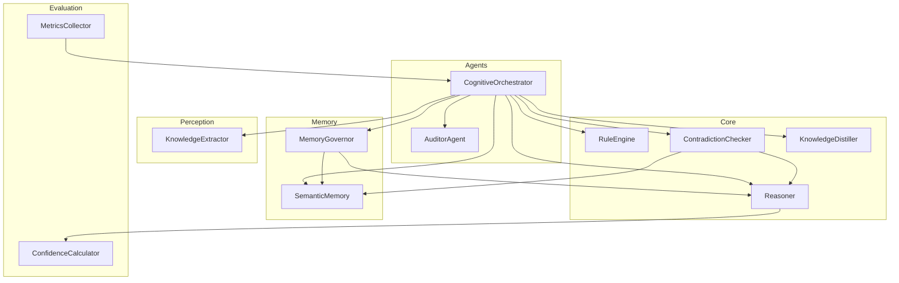

**Diagram sources**
- [orchestrator.py:23-42](file://src/agents/orchestrator.py#L23-L42)
- [auditor.py:8-22](file://src/agents/auditor.py#L8-L22)
- [reasoner.py:145-180](file://src/core/reasoner.py#L145-L180)
- [rule_engine.py:124-139](file://src/core/ontology/rule_engine.py#L124-L139)
- [self_correction.py:7-16](file://src/evolution/self_correction.py#L7-L16)
- [distillation.py:7-16](file://src/evolution/distillation.py#L7-L16)
- [base.py:9-28](file://src/memory/base.py#L9-L28)
- [governance.py:6-18](file://src/memory/governance.py#L6-L18)
- [confidence.py:32-61](file://src/eval/confidence.py#L32-L61)
- [monitoring.py:20-41](file://src/eval/monitoring.py#L20-L41)

**Section sources**
- [architecture.md:1-35](file://docs/architecture.md#L1-L35)

## Core Components
- AST-based SafeMathSandbox: Executes validated mathematical/logical expressions safely using Python’s AST evaluator, enabling precise numeric checks before actions or decisions are executed.
- RuleEngine: Loads, registers, and evaluates domain rules against runtime contexts; detects conflicts across rules and records audit trails.
- ContradictionChecker: Validates proposed facts against existing knowledge and external graph constraints to prevent data poisoning.
- ReflectionLoop: Provides post-decision reflection and rationale assessment.
- KnowledgeDistiller: Extracts structured facts from unstructured text and suggests schema updates.
- GrainValidator: Prevents “fan-trap” risks in aggregations by validating entity grain cardinalities.
- Reasoner: Symbolic reasoning with confidence propagation across inference steps.
- MemoryGovernor: Applies confidence-based pruning and reinforcement to maintain a healthy knowledge graph.
- ConfidenceCalculator: Computes and propagates confidence using multiple methods (weighted, Bayesian, multiplicative, Dempster–Shafer).
- Orchestrator: Integrates all components, enforces gating rules, and coordinates audits and governance.

**Section sources**
- [rule_engine.py:14-86](file://src/core/ontology/rule_engine.py#L14-L86)
- [rule_engine.py:124-331](file://src/core/ontology/rule_engine.py#L124-L331)
- [self_correction.py:7-90](file://src/evolution/self_correction.py#L7-L90)
- [distillation.py:7-27](file://src/evolution/distillation.py#L7-L27)
- [grain_validator.py:13-61](file://src/core/ontology/grain_validator.py#L13-L61)
- [reasoner.py:145-800](file://src/core/reasoner.py#L145-L800)
- [governance.py:6-62](file://src/memory/governance.py#L6-L62)
- [confidence.py:32-260](file://src/eval/confidence.py#L32-L260)
- [orchestrator.py:23-42](file://src/agents/orchestrator.py#L23-L42)

## Architecture Overview
The system enforces safety at multiple layers:
- Pre-execution gating via RuleEngine’s SafeMathSandbox
- Runtime auditing via GrainValidator and AuditorAgent
- Post-execution self-correction via ContradictionChecker
- Continuous knowledge refinement via KnowledgeDistiller
- Confidence-aware reasoning and governance-driven pruning

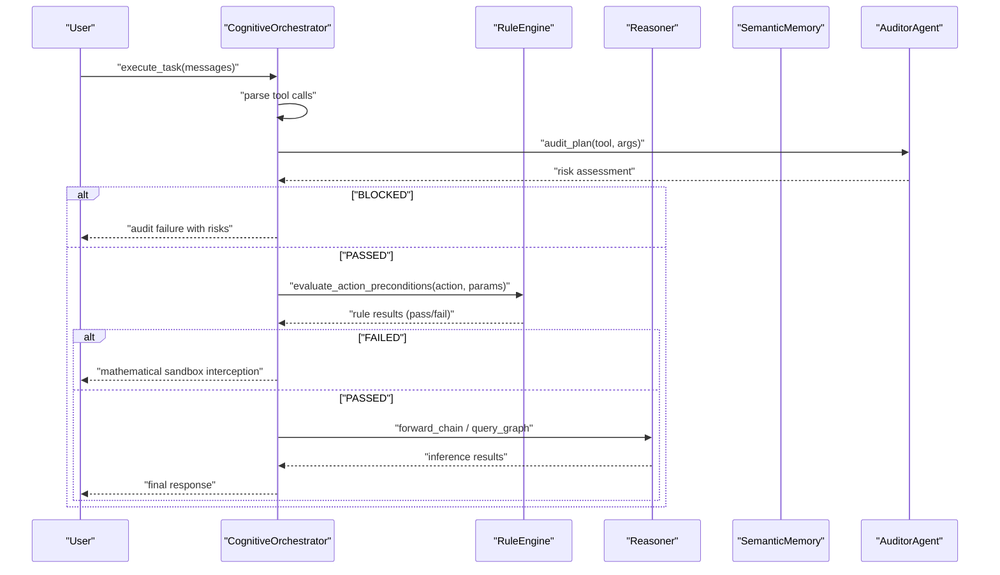

**Diagram sources**
- [orchestrator.py:228-346](file://src/agents/orchestrator.py#L228-L346)
- [auditor.py:24-65](file://src/agents/auditor.py#L24-L65)
- [rule_engine.py:320-331](file://src/core/ontology/rule_engine.py#L320-L331)
- [reasoner.py:243-349](file://src/core/reasoner.py#L243-L349)

## Detailed Component Analysis

### AST-Level Mathematical Sandbox
The SafeMathSandbox parses and evaluates expressions in a restricted AST environment, supporting arithmetic, comparisons, logical operators, and selected math functions. It ensures numeric and logical constraints are evaluated deterministically, preventing LLM hallucinations in quantitative decisions.

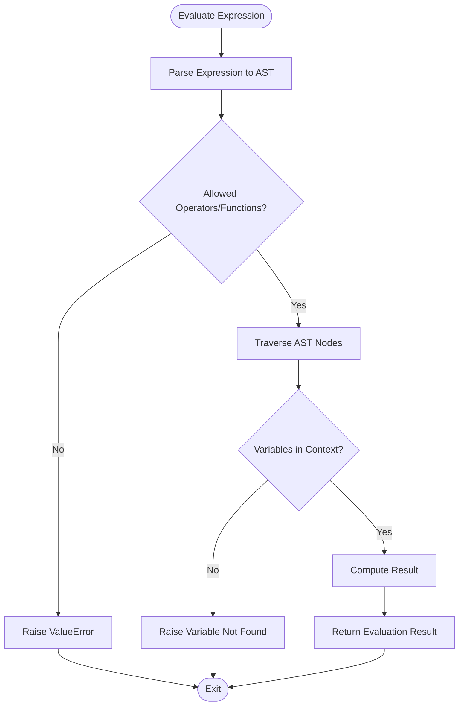

**Diagram sources**
- [rule_engine.py:32-85](file://src/core/ontology/rule_engine.py#L32-L85)

**Section sources**
- [rule_engine.py:14-86](file://src/core/ontology/rule_engine.py#L14-L86)

### Rule Engine and Conflict Detection
The RuleEngine registers rules with conflict detection, maintains an audit trail, and evaluates rules against runtime contexts. It aggregates rule results for action preconditions and reports violations to the orchestrator.

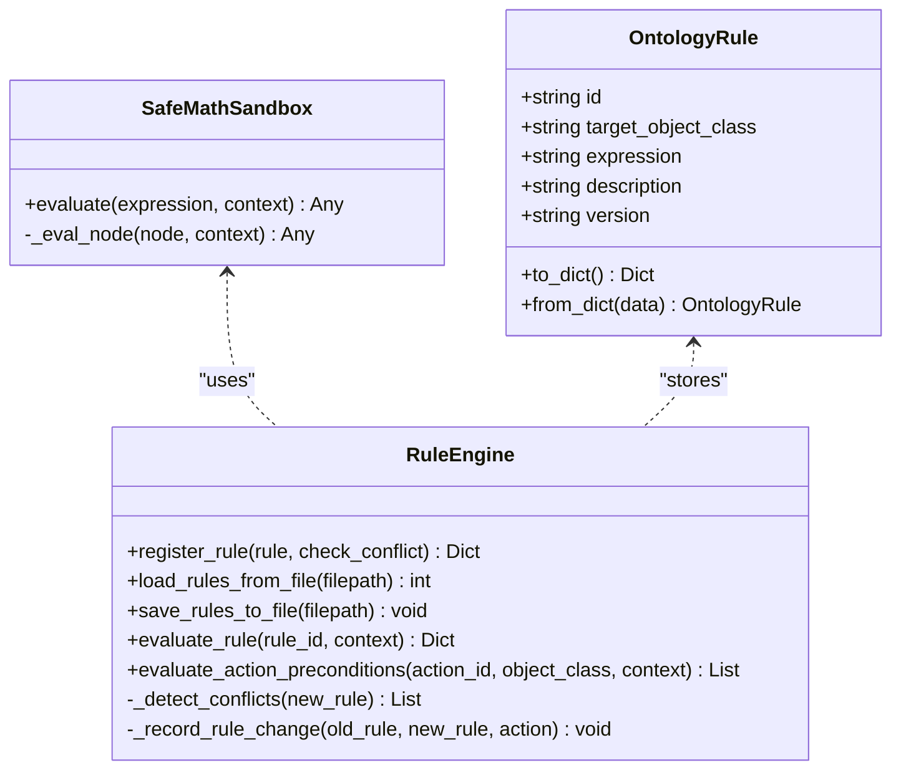

**Diagram sources**
- [rule_engine.py:14-139](file://src/core/ontology/rule_engine.py#L14-L139)
- [rule_engine.py:172-331](file://src/core/ontology/rule_engine.py#L172-L331)

**Section sources**
- [rule_engine.py:124-331](file://src/core/ontology/rule_engine.py#L124-L331)

### Contradiction Detection and Self-Correction
The ContradictionChecker verifies proposed facts against known antonyms and existing facts, optionally consulting a graph database. The ReflectionLoop supports post-hoc reasoning assessment.

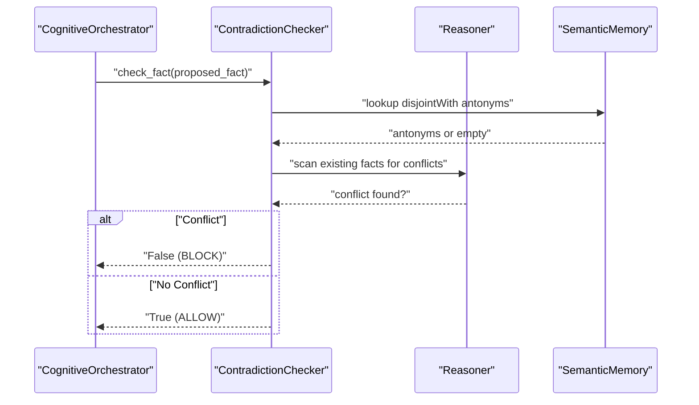

**Diagram sources**
- [self_correction.py:46-73](file://src/evolution/self_correction.py#L46-L73)
- [orchestrator.py:248-252](file://src/agents/orchestrator.py#L248-L252)

**Section sources**
- [self_correction.py:7-90](file://src/evolution/self_correction.py#L7-L90)

### Evidence Propagation and Confidence-Aware Reasoning
The Reasoner computes confidence for derived facts and propagates confidence along inference chains. ConfidenceCalculator supports multiple methods and integrates with evaluation metrics.

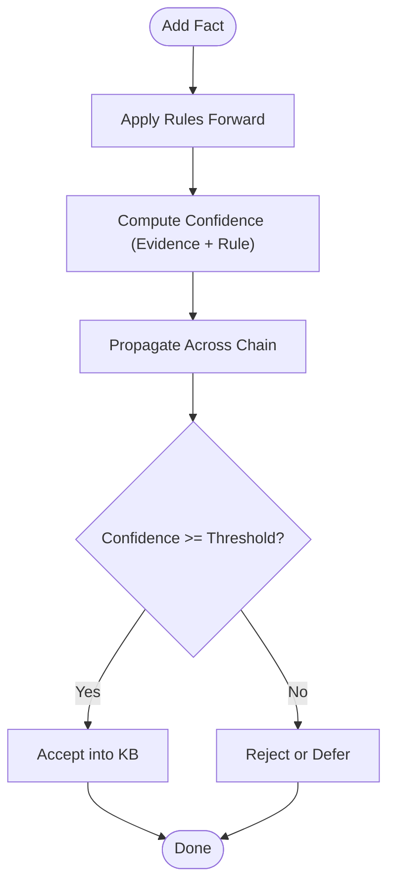

**Diagram sources**
- [reasoner.py:243-349](file://src/core/reasoner.py#L243-L349)
- [confidence.py:222-260](file://src/eval/confidence.py#L222-L260)

**Section sources**
- [reasoner.py:145-350](file://src/core/reasoner.py#L145-L350)
- [confidence.py:32-260](file://src/eval/confidence.py#L32-L260)

### Grain Validator and Fan-Trip Prevention
The GrainValidator inspects query intent and entity cardinalities to detect fan-trap risks in aggregations, providing risk assessments and corrective suggestions.

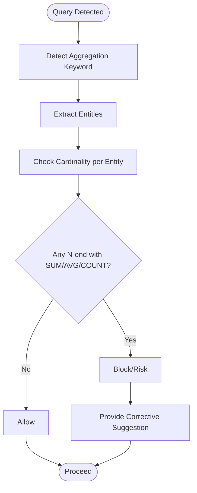

**Diagram sources**
- [auditor.py:34-65](file://src/agents/auditor.py#L34-L65)
- [grain_validator.py:24-55](file://src/core/ontology/grain_validator.py#L24-L55)

**Section sources**
- [grain_validator.py:13-61](file://src/core/ontology/grain_validator.py#L13-L61)
- [auditor.py:8-72](file://src/agents/auditor.py#L8-L72)

### Knowledge Distillation and Continuous Improvement
The KnowledgeDistiller extracts structured facts from unstructured text and suggests schema updates, enabling continuous evolution of the knowledge base.

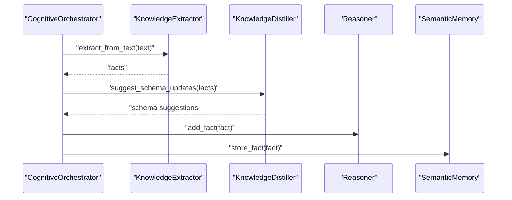

**Diagram sources**
- [orchestrator.py:243-259](file://src/agents/orchestrator.py#L243-L259)
- [distillation.py:18-26](file://src/evolution/distillation.py#L18-L26)
- [base.py:91-110](file://src/memory/base.py#L91-L110)

**Section sources**
- [distillation.py:7-27](file://src/evolution/distillation.py#L7-L27)
- [orchestrator.py:243-259](file://src/agents/orchestrator.py#L243-L259)
- [base.py:91-110](file://src/memory/base.py#L91-L110)

### Decision Auditing and Human-in-the-Loop Validation
The AuditorAgent performs旁路审计 for tool plans, flagging risky operations and offering corrective guidance. The orchestrator integrates these signals to block or guide unsafe actions.

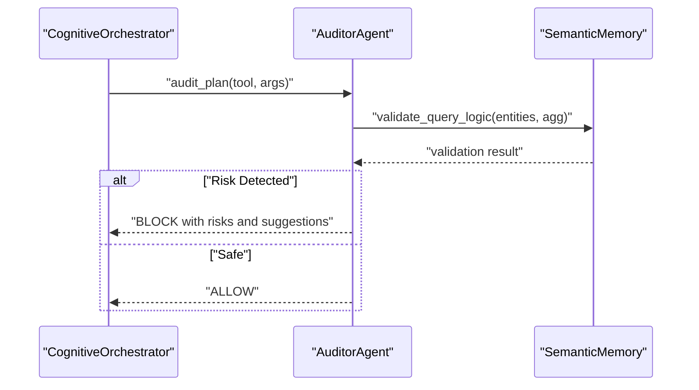

**Diagram sources**
- [auditor.py:24-65](file://src/agents/auditor.py#L24-L65)
- [orchestrator.py:228-240](file://src/agents/orchestrator.py#L228-L240)

**Section sources**
- [auditor.py:8-72](file://src/agents/auditor.py#L8-L72)
- [orchestrator.py:228-240](file://src/agents/orchestrator.py#L228-L240)

### Integration with the Orchestrator
The orchestrator wires together all safety components: it invokes the RuleEngine for gating, the GrainValidator via the AuditorAgent for query auditing, the ContradictionChecker for fact ingestion, and the MemoryGovernor for post-execution pruning and reinforcement.

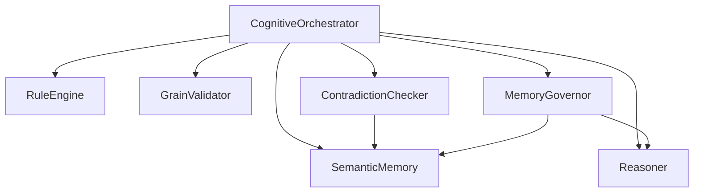

**Diagram sources**
- [orchestrator.py:28-42](file://src/agents/orchestrator.py#L28-L42)
- [auditor.py:17-22](file://src/agents/auditor.py#L17-L22)
- [self_correction.py:14-16](file://src/evolution/self_correction.py#L14-L16)
- [governance.py:13-18](file://src/memory/governance.py#L13-L18)

**Section sources**
- [orchestrator.py:23-42](file://src/agents/orchestrator.py#L23-L42)

## Dependency Analysis
The safety subsystem exhibits strong cohesion around shared abstractions:
- RuleEngine depends on SafeMathSandbox for expression evaluation
- ContradictionChecker depends on Reasoner and SemanticMemory
- GrainValidator depends on SemanticMemory for cardinality queries
- MemoryGovernor depends on Reasoner and SemanticMemory
- ConfidenceCalculator underpins reasoning and evaluation

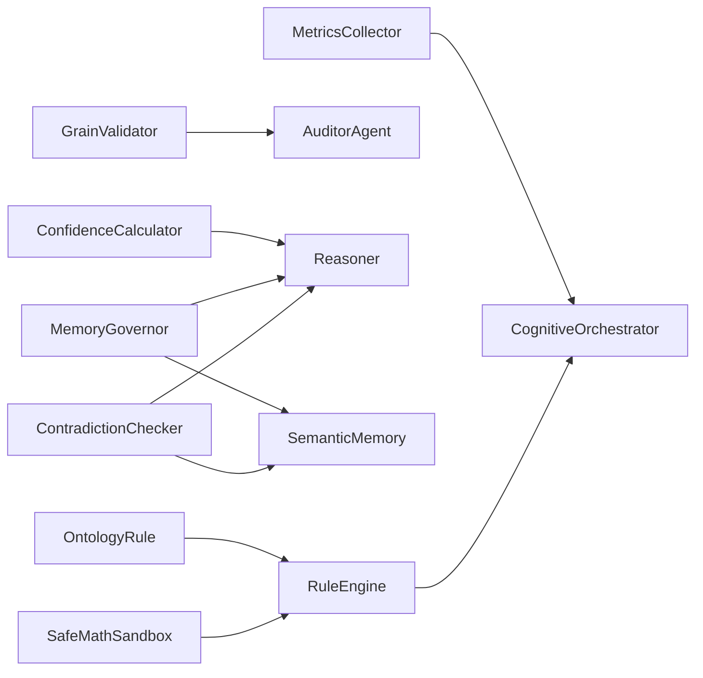

**Diagram sources**
- [rule_engine.py:14-139](file://src/core/ontology/rule_engine.py#L14-L139)
- [auditor.py:17-22](file://src/agents/auditor.py#L17-L22)
- [self_correction.py:14-16](file://src/evolution/self_correction.py#L14-L16)
- [governance.py:13-18](file://src/memory/governance.py#L13-L18)
- [confidence.py:32-61](file://src/eval/confidence.py#L32-L61)
- [monitoring.py:20-41](file://src/eval/monitoring.py#L20-L41)

**Section sources**
- [rule_engine.py:124-331](file://src/core/ontology/rule_engine.py#L124-L331)
- [self_correction.py:7-90](file://src/evolution/self_correction.py#L7-L90)
- [grain_validator.py:13-61](file://src/core/ontology/grain_validator.py#L13-L61)
- [governance.py:6-62](file://src/memory/governance.py#L6-L62)
- [confidence.py:32-260](file://src/eval/confidence.py#L32-L260)
- [monitoring.py:20-110](file://src/eval/monitoring.py#L20-L110)

## Performance Considerations
- Circuit breakers in forward/backward chaining cap inference time to avoid runaway computation.
- Token-bucket rate limiting and input sanitization protect upstream services.
- Metrics collection tracks inference latency and request throughput for observability.
- MemoryGovernor periodically prunes low-confidence facts to keep reasoning efficient.

[No sources needed since this section provides general guidance]

## Troubleshooting Guide
Common issues and resolutions:
- Rule evaluation failures: Inspect expression syntax and variable bindings; confirm SafeMathSandbox constraints.
- Audit interceptions: Review risk details and suggested corrections; adjust query or parameters accordingly.
- Contradictions during ingestion: Align proposed facts with antonyms and existing knowledge; consider manual review.
- Low-confidence reasoning: Increase evidence reliability or strengthen rules; monitor propagation.
- Fan-trap detections: Refactor SQL to pre-aggregate or use distinct joins; validate entity cardinalities.

**Section sources**
- [rule_engine.py:50-56](file://src/core/ontology/rule_engine.py#L50-L56)
- [orchestrator.py:228-240](file://src/agents/orchestrator.py#L228-L240)
- [self_correction.py:66-73](file://src/evolution/self_correction.py#L66-L73)
- [confidence.py:222-260](file://src/eval/confidence.py#L222-L260)
- [auditor.py:57-58](file://src/agents/auditor.py#L57-L58)

## Conclusion
The safety and validation systems form a layered defense against hallucinations and logical inconsistencies. By combining AST-based mathematical sandboxing, rule-based gating, contradiction detection, confidence-aware reasoning, and governance-driven pruning, the platform ensures robust, auditable, and continuously improving knowledge operations.

[No sources needed since this section summarizes without analyzing specific files]

## Appendices

### Mathematical Foundations of Safety Constraints
- Deterministic evaluation via AST prevents symbolic ambiguity.
- Operator/function whitelisting limits computational scope.
- Numeric thresholds (e.g., ≥1.5x margin) encode domain-specific safety margins.
- OWL open-world assumption requires explicit constraints and validation.

**Section sources**
- [rule_engine.py:18-30](file://src/core/ontology/rule_engine.py#L18-L30)
- [rule_engine.py:142-170](file://src/core/ontology/rule_engine.py#L142-L170)
- [reasoner.py:5-11](file://src/core/reasoner.py#L5-L11)

### Relationship Between Confidence Levels and Safety Thresholds
- Facts below a threshold are withheld from KB until validated.
- Inference chains propagate conservative confidence (e.g., minimum across steps).
- Governance prunes low-confidence facts to reduce risk.

**Section sources**
- [confidence.py:222-260](file://src/eval/confidence.py#L222-L260)
- [governance.py:16-18](file://src/memory/governance.py#L16-L18)
- [governance.py:47-62](file://src/memory/governance.py#L47-L62)

### Automated Quality Assurance and Monitoring
- Metrics collectors expose request latencies and inference durations.
- Health checks aggregate component statuses.
- Structured request logging correlates traces with outcomes.

**Section sources**
- [monitoring.py:20-110](file://src/eval/monitoring.py#L20-L110)
- [monitoring.py:180-220](file://src/eval/monitoring.py#L180-L220)
- [monitoring.py:255-295](file://src/eval/monitoring.py#L255-L295)

### Security Controls Supporting Safety
- API key management, rate limiting, and IP blocking mitigate abuse.
- Input sanitization and validation guard against injection and malformed data.
- Security headers and audit logging support compliance.

**Section sources**
- [security.py:21-93](file://src/core/security.py#L21-L93)
- [security.py:98-157](file://src/core/security.py#L98-L157)
- [security.py:243-320](file://src/core/security.py#L243-L320)
- [security.py:358-406](file://src/core/security.py#L358-L406)