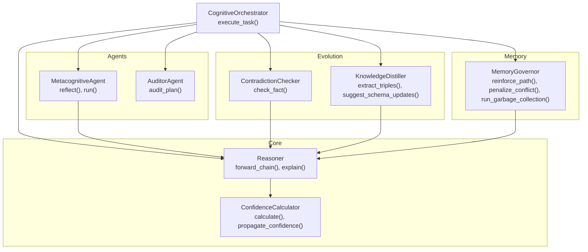
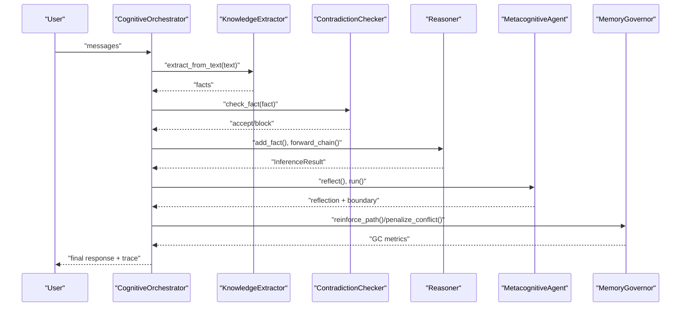
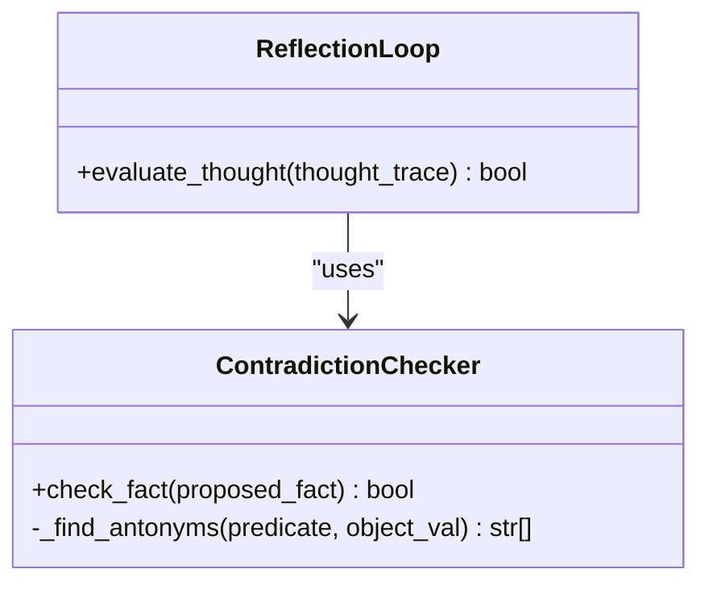
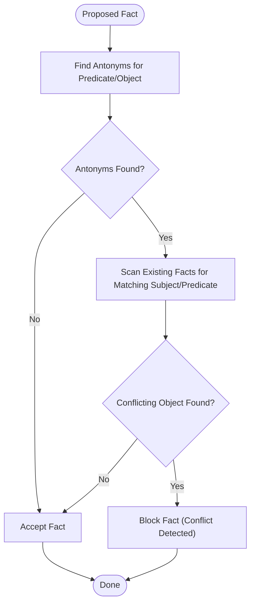
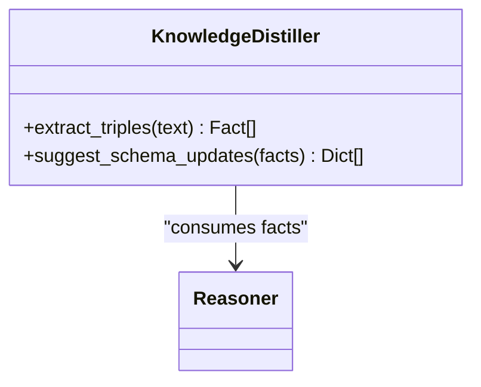
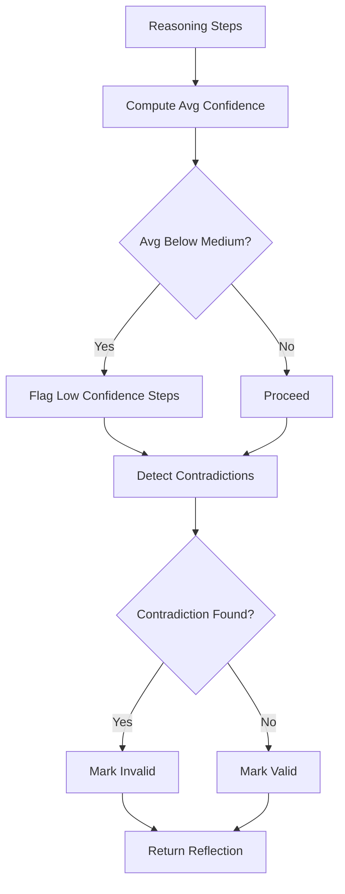
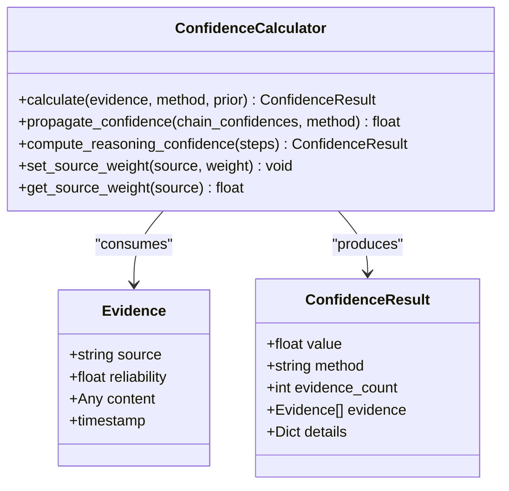
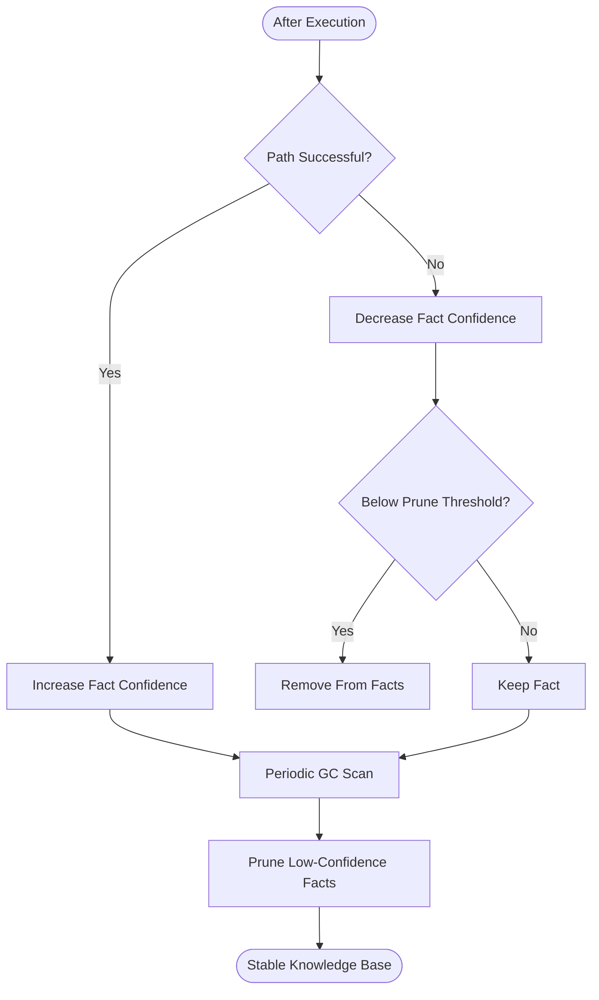
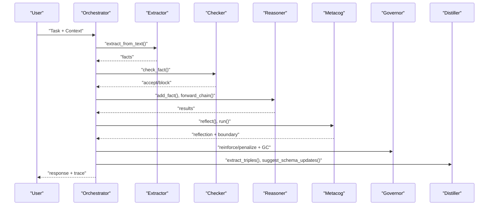
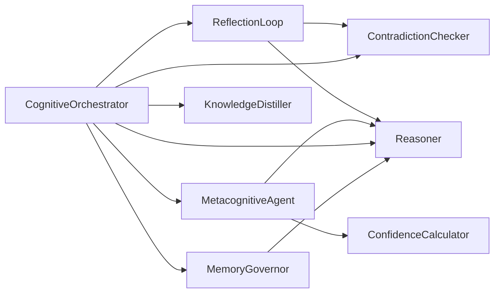

# Self-Correction and Knowledge Refinement

<cite>
**Referenced Files in This Document**
- [self_correction.py](file://src/evolution/self_correction.py)
- [distillation.py](file://src/evolution/distillation.py)
- [metacognition.py](file://src/agents/metacognition.py)
- [confidence.py](file://src/eval/confidence.py)
- [reasoner.py](file://src/core/reasoner.py)
- [governance.py](file://src/memory/governance.py)
- [orchestrator.py](file://src/agents/orchestrator.py)
- [demo_confidence_reasoning.py](file://examples/demo_confidence_reasoning.py)
- [test_metacognition.py](file://tests/test_metacognition.py)
- [test_confidence.py](file://tests/test_confidence.py)
- [test_reasoner.py](file://tests/test_reasoner.py)
</cite>

## Table of Contents
1. [Introduction](#introduction)
2. [Project Structure](#project-structure)
3. [Core Components](#core-components)
4. [Architecture Overview](#architecture-overview)
5. [Detailed Component Analysis](#detailed-component-analysis)
6. [Dependency Analysis](#dependency-analysis)
7. [Performance Considerations](#performance-considerations)
8. [Troubleshooting Guide](#troubleshooting-guide)
9. [Conclusion](#conclusion)
10. [Appendices](#appendices)

## Introduction
This document describes the self-correction and knowledge refinement system that enables automated validation and continuous improvement of knowledge within the platform. It focuses on:
- ReflectionLoop for decision tracing and post-hoc validation
- Integration with KnowledgeDistiller for continuous knowledge ingestion and schema evolution
- Conflict resolution via a contradiction checker
- Evidence aggregation and confidence propagation
- Iterative refinement workflow
- Practical correction scenarios, confidence threshold tuning, and self-correction frequency vs. stability
- Human-in-the-loop validation and escalation criteria for safety-critical applications

## Project Structure
The self-correction system spans several layers:
- Evolution layer: self-correction and knowledge distillation
- Agents: metacognition and auditing
- Core reasoning: rule engine and confidence propagation
- Memory governance: pruning and reinforcement
- Orchestrator: integrates all components into a cohesive loop

**Diagram sources**
- [orchestrator.py:23-42](file://src/agents/orchestrator.py#L23-L42)
- [metacognition.py:8-70](file://src/agents/metacognition.py#L8-L70)
- [self_correction.py:7-89](file://src/evolution/self_correction.py#L7-L89)
- [distillation.py:7-26](file://src/evolution/distillation.py#L7-L26)
- [reasoner.py:145-349](file://src/core/reasoner.py#L145-L349)
- [confidence.py:32-297](file://src/eval/confidence.py#L32-L297)
- [governance.py:6-62](file://src/memory/governance.py#L6-L62)

**Section sources**
- [orchestrator.py:23-42](file://src/agents/orchestrator.py#L23-L42)
- [self_correction.py:7-89](file://src/evolution/self_correction.py#L7-L89)
- [distillation.py:7-26](file://src/evolution/distillation.py#L7-L26)
- [metacognition.py:8-70](file://src/agents/metacognition.py#L8-L70)
- [reasoner.py:145-349](file://src/core/reasoner.py#L145-L349)
- [confidence.py:32-297](file://src/eval/confidence.py#L32-L297)
- [governance.py:6-62](file://src/memory/governance.py#L6-L62)

## Core Components
- ReflectionLoop: evaluates reasoning traces and validates decisions before/after execution.
- ContradictionChecker: prevents knowledge poisoning by detecting conflicts against existing facts and optional semantic memory.
- KnowledgeDistiller: extracts structured facts and suggests schema updates from unstructured inputs.
- MetacognitiveAgent: self-assesses reasoning quality, confidence calibration, and knowledge boundary detection.
- Reasoner: performs forward/backward chaining with confidence propagation and explanation.
- ConfidenceCalculator: aggregates evidence and propagates confidence along reasoning chains.
- MemoryGovernor: reinforces useful paths and prunes low-confidence stale knowledge.

**Section sources**
- [self_correction.py:76-89](file://src/evolution/self_correction.py#L76-L89)
- [self_correction.py:46-73](file://src/evolution/self_correction.py#L46-L73)
- [distillation.py:7-26](file://src/evolution/distillation.py#L7-L26)
- [metacognition.py:23-70](file://src/agents/metacognition.py#L23-L70)
- [reasoner.py:243-349](file://src/core/reasoner.py#L243-L349)
- [confidence.py:63-297](file://src/eval/confidence.py#L63-L297)
- [governance.py:20-62](file://src/memory/governance.py#L20-L62)

## Architecture Overview
The system orchestrates a closed-loop of perception, reasoning, reflection, and evolution:
- Perception: KnowledgeExtractor produces facts from user input.
- Execution: Tools are audited and executed under sandbox rules.
- Reasoning: Reasoner derives conclusions and computes confidence.
- Reflection: MetacognitiveAgent evaluates reasoning quality and boundary crossing.
- Correction: ContradictionChecker blocks contradictions; MemoryGovernor prunes and reinforces.
- Evolution: KnowledgeDistiller suggests schema updates and future-proofing.

**Diagram sources**
- [orchestrator.py:242-363](file://src/agents/orchestrator.py#L242-L363)
- [self_correction.py:46-73](file://src/evolution/self_correction.py#L46-L73)
- [reasoner.py:243-349](file://src/core/reasoner.py#L243-L349)
- [metacognition.py:92-133](file://src/agents/metacognition.py#L92-L133)
- [governance.py:20-62](file://src/memory/governance.py#L20-L62)

## Detailed Component Analysis

### ReflectionLoop and Decision Tracing
ReflectionLoop coordinates pre-execution checks and post-execution validation. It delegates to ContradictionChecker to ensure logical consistency before storing new facts or executing actions.

**Diagram sources**
- [self_correction.py:76-89](file://src/evolution/self_correction.py#L76-L89)
- [self_correction.py:46-73](file://src/evolution/self_correction.py#L46-L73)

Practical usage:
- Pre-store validation: before adding a fact to the Reasoner and Semantic Memory, call the checker.
- Post-execution reflection: after reasoning, evaluate the thought trace for consistency.

**Section sources**
- [self_correction.py:76-89](file://src/evolution/self_correction.py#L76-L89)
- [self_correction.py:46-73](file://src/evolution/self_correction.py#L46-L73)

### Conflict Resolution and Antonym Discovery
The checker identifies potential conflicts by:
- Querying semantic memory for disjoint/disallowed predicates (when connected)
- Falling back to a local antonym registry for safety
- Scanning existing facts for direct contradictions

**Diagram sources**
- [self_correction.py:18-73](file://src/evolution/self_correction.py#L18-L73)

Operational notes:
- When semantic memory is unavailable, the checker uses a hard-coded antonym map to avoid unsafe insertions.
- Logging records conflict events for auditability.

**Section sources**
- [self_correction.py:18-73](file://src/evolution/self_correction.py#L18-L73)

### Knowledge Distillation and Schema Evolution
KnowledgeDistiller extracts structured triples and proposes schema updates. While the extraction is currently a placeholder, the interface supports future LLM-driven ingestion.

**Diagram sources**
- [distillation.py:7-26](file://src/evolution/distillation.py#L7-L26)

Integration points:
- Orchestrator invokes extraction and passes facts through the contradiction checker before adding to the Reasoner and Semantic Memory.
- Suggested schema updates can be evaluated and applied to evolve the ontology.

**Section sources**
- [distillation.py:7-26](file://src/evolution/distillation.py#L7-L26)
- [orchestrator.py:243-258](file://src/agents/orchestrator.py#L243-L258)

### Metacognitive Self-Assessment and Knowledge Boundary
MetacognitiveAgent assesses reasoning quality, calibrates confidence, and determines whether a query is within the knowledge boundary. It:
- Computes average confidence across reasoning steps
- Flags low-confidence steps
- Detects contradictions heuristically
- Provides boundary classification and recommendations

**Diagram sources**
- [metacognition.py:23-70](file://src/agents/metacognition.py#L23-L70)

Confidence calibration:
- Combines evidence count (with diminishing returns) and quality into a calibrated score capped modestly to preserve humility.

**Section sources**
- [metacognition.py:23-70](file://src/agents/metacognition.py#L23-L70)
- [metacognition.py:175-203](file://src/agents/metacognition.py#L175-L203)

### Evidence Aggregation and Confidence Propagation
Evidence is aggregated from multiple sources, each with reliability. ConfidenceCalculator supports:
- Weighted averaging
- Multiplicative combination
- Bayesian updating
- Dempster-Shafer fusion
- Propagation along reasoning chains (min, arithmetic, geometric, multiplicative)

**Diagram sources**
- [confidence.py:13-297](file://src/eval/confidence.py#L13-L297)

Usage in reasoning:
- Reasoner constructs Evidence for facts and rules, then calculates conclusion confidence and propagates along the chain.

**Section sources**
- [confidence.py:63-297](file://src/eval/confidence.py#L63-L297)
- [reasoner.py:294-342](file://src/core/reasoner.py#L294-L342)

### Memory Governance and Stability Controls
MemoryGovernor enforces stability by:
- Reinforcing paths that lead to successful outcomes
- Penalizing conflicting or low-reliability facts
- Periodic garbage collection to prune stale nodes below a threshold

**Diagram sources**
- [governance.py:20-62](file://src/memory/governance.py#L20-L62)

**Section sources**
- [governance.py:20-62](file://src/memory/governance.py#L20-L62)

### Iterative Refinement Workflow
The loop integrates all components:
1. Perception: Extract facts from user input
2. Validation: Run through ContradictionChecker
3. Reasoning: Forward chain with confidence propagation
4. Reflection: Evaluate reasoning quality and boundaries
5. Governance: Reinforce or prune based on outcomes
6. Evolution: Distill new knowledge and propose schema updates

**Diagram sources**
- [orchestrator.py:242-363](file://src/agents/orchestrator.py#L242-L363)
- [self_correction.py:46-73](file://src/evolution/self_correction.py#L46-L73)
- [reasoner.py:243-349](file://src/core/reasoner.py#L243-L349)
- [metacognition.py:92-133](file://src/agents/metacognition.py#L92-L133)
- [governance.py:20-62](file://src/memory/governance.py#L20-L62)
- [distillation.py:18-26](file://src/evolution/distillation.py#L18-L26)

## Dependency Analysis
Key dependencies and coupling:
- ReflectionLoop depends on Reasoner and ContradictionChecker
- MetacognitiveAgent depends on Reasoner and ConfidenceCalculator
- Orchestrator composes all components and coordinates tool calls
- MemoryGovernor interacts with Reasoner’s facts to enforce stability

**Diagram sources**
- [self_correction.py:76-89](file://src/evolution/self_correction.py#L76-L89)
- [metacognition.py:23-70](file://src/agents/metacognition.py#L23-L70)
- [confidence.py:63-297](file://src/eval/confidence.py#L63-L297)
- [orchestrator.py:23-42](file://src/agents/orchestrator.py#L23-L42)
- [governance.py:6-62](file://src/memory/governance.py#L6-L62)

**Section sources**
- [self_correction.py:76-89](file://src/evolution/self_correction.py#L76-L89)
- [metacognition.py:23-70](file://src/agents/metacognition.py#L23-L70)
- [confidence.py:63-297](file://src/eval/confidence.py#L63-L297)
- [orchestrator.py:23-42](file://src/agents/orchestrator.py#L23-L42)
- [governance.py:6-62](file://src/memory/governance.py#L6-L62)

## Performance Considerations
- Circuit breakers: Reasoner enforces timeouts during forward/backward chaining to prevent runaway computation.
- Caching and batching: The performance module provides LRU caching, connection pooling, and async batching utilities that can be leveraged to improve throughput in orchestrator workflows.
- Confidence propagation: Using conservative propagation (min) reduces optimistic drift in long chains.

Recommendations:
- Tune max_depth and timeout in Reasoner based on domain complexity.
- Apply caching to repeated queries and extraction calls.
- Monitor GC metrics to balance pruning aggressiveness with stability.

**Section sources**
- [reasoner.py:274-277](file://src/core/reasoner.py#L274-L277)
- [reasoner.py:379-382](file://src/core/reasoner.py#L379-L382)
- [performance.py:25-167](file://src/eval/performance.py#L25-L167)
- [performance.py:170-263](file://src/eval/performance.py#L170-L263)
- [performance.py:290-320](file://src/eval/performance.py#L290-L320)

## Troubleshooting Guide
Common issues and resolutions:
- Contradiction detected: Review the proposed fact’s predicate/object against existing facts and antonyms. Adjust or reject the insertion.
- Low confidence reasoning: Gather more evidence or improve source reliability. Use MetacognitiveAgent suggestions to identify weak links.
- Knowledge boundary exceeded: Escalate to human expert or external verification when confidence falls below thresholds.
- Stale knowledge accumulation: Enable periodic garbage collection and monitor prune thresholds.

Validation references:
- Confidence calculator tests confirm weighted, multiplicative, and source-weight behaviors.
- Metacognition tests verify reflection, boundary detection, and calibration logic.
- Reasoner tests validate rule and fact handling, inference, and confidence propagation.

**Section sources**
- [test_confidence.py:11-61](file://tests/test_confidence.py#L11-L61)
- [test_metacognition.py:21-142](file://tests/test_metacognition.py#L21-L142)
- [test_reasoner.py:63-200](file://tests/test_reasoner.py#L63-L200)

## Conclusion
The self-correction system couples automated validation (contradiction checking, confidence propagation, reflection) with continuous evolution (knowledge distillation, schema updates) and stability controls (memory governance). By integrating these components through the orchestrator, the platform achieves robust, interpretable, and continuously improving knowledge processing suitable for safety-critical deployments.

## Appendices

### Practical Correction Scenarios
- Scenario A: Extraction yields a contradictory fact (e.g., opposite risk classification). The ContradictionChecker blocks it; the system logs the event and prompts human review.
- Scenario B: Reasoning chain has a weak link. MetacognitiveAgent flags it; the orchestrator requests additional context or evidence.
- Scenario C: Frequent conflicting facts degrade system stability. MemoryGovernor prunes low-confidence nodes; operators adjust thresholds or refine rules.

### Confidence Threshold Adjustments
- High confidence: Proceed automatically; reinforce successful paths.
- Medium confidence: Request additional evidence or cross-check.
- Low confidence: Escalate to human expert; optionally block action.
- Unknown/beyond boundary: Do not act; guide user to external expertise.

### Self-Correction Frequency vs. Stability
- Higher frequency: Faster adaptation but riskier; use stricter penalties and pruning thresholds.
- Lower frequency: Slower evolution but more stable; ensure adequate evidence aggregation and governance cadence.

### Human-in-the-Loop Validation and Escalation
- Escalation triggers:
  - Contradictions detected
  - Knowledge boundary exceeded
  - Low confidence reasoning
  - Frequent governance pruning indicating instability
- Validation criteria:
  - Evidence quality and quantity
  - Logical consistency across steps
  - Alignment with domain rules and schema

[No sources needed since this section provides general guidance]