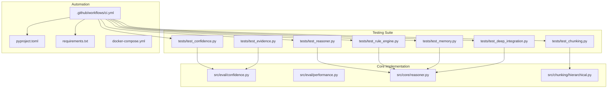
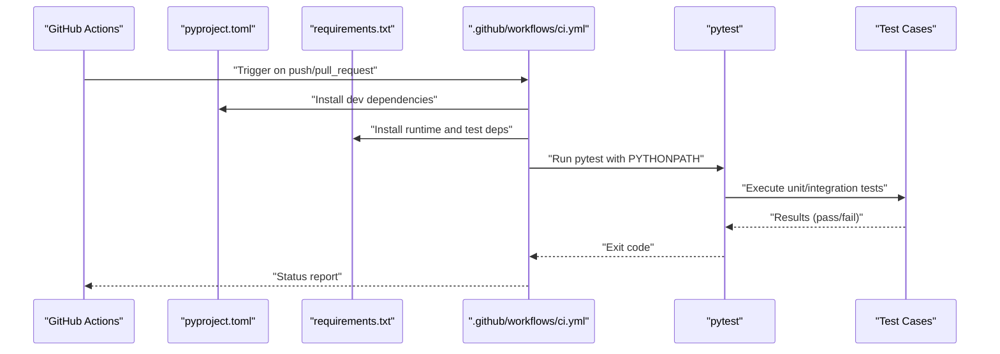
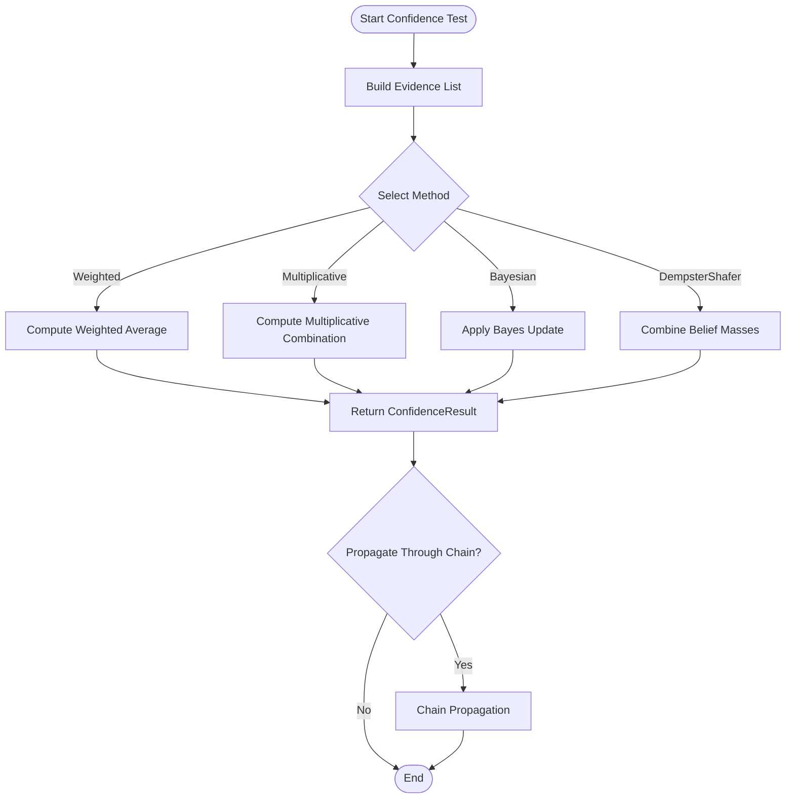
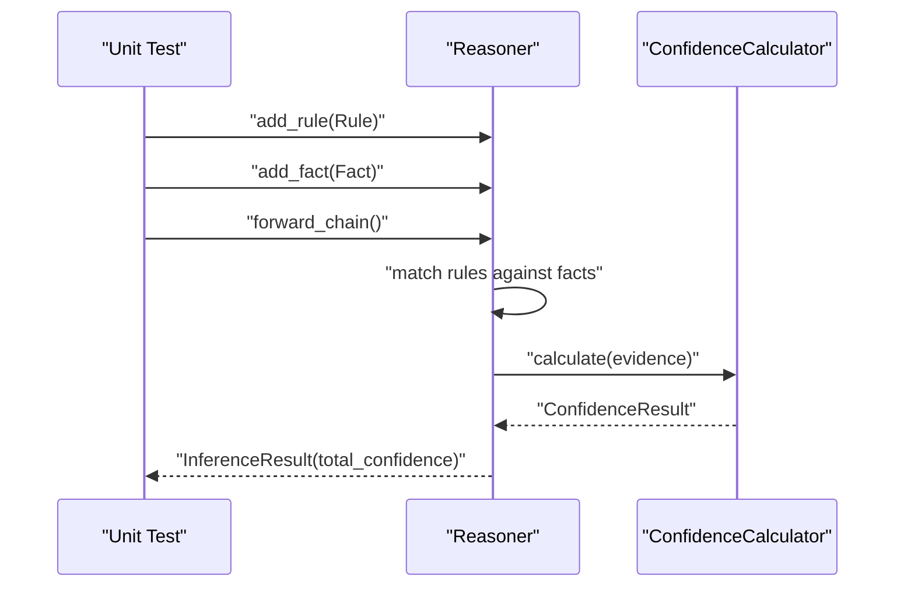
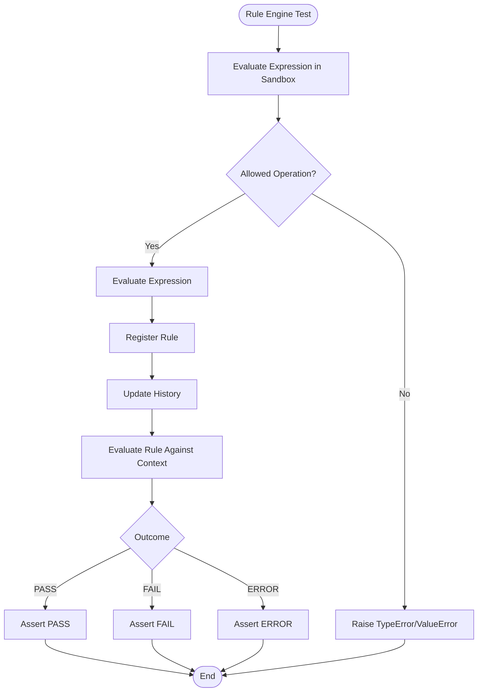
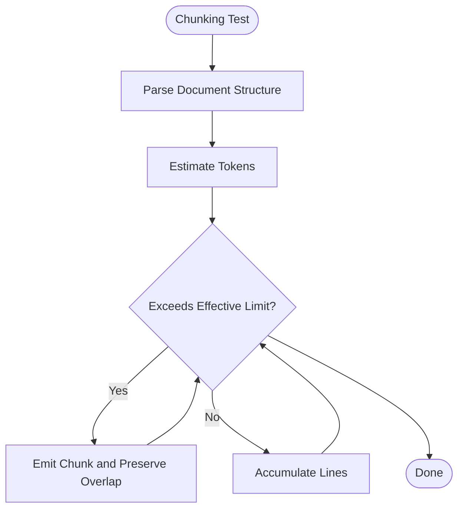
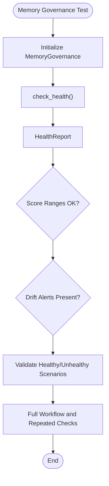
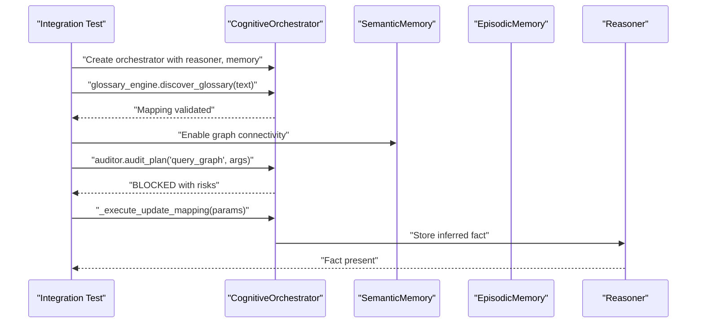
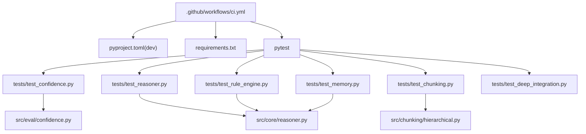
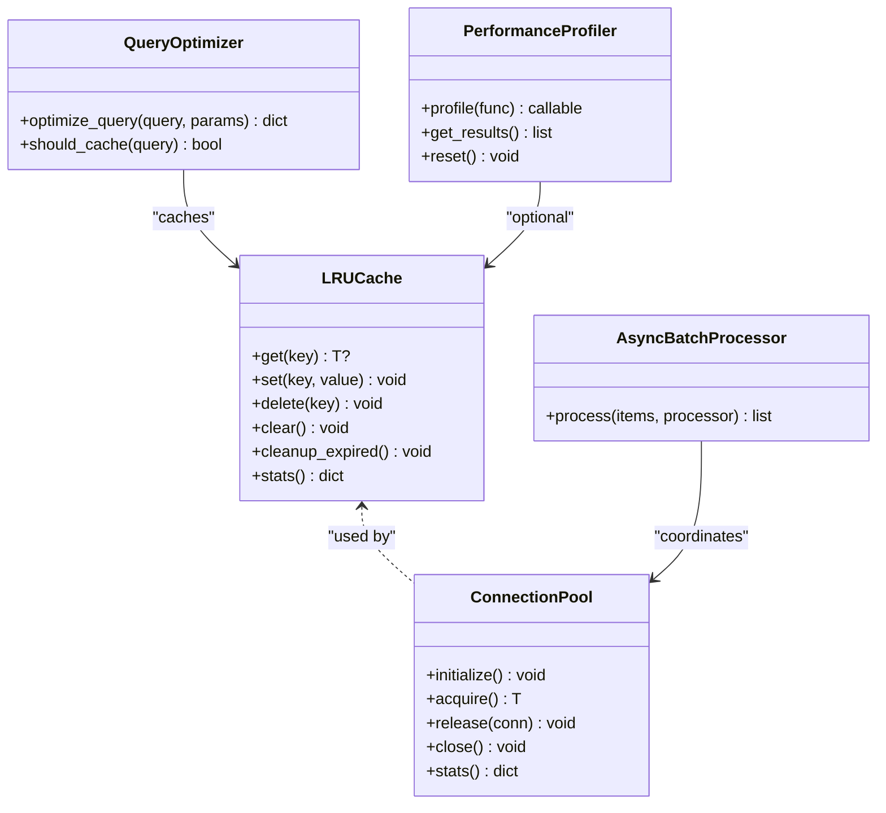

# Testing and Quality Assurance

<cite>
**Referenced Files in This Document**
- [tests/README.md](file://tests/README.md)
- [tests/test_confidence.py](file://tests/test_confidence.py)
- [tests/test_evidence.py](file://tests/test_evidence.py)
- [tests/test_reasoner.py](file://tests/test_reasoner.py)
- [tests/test_rule_engine.py](file://tests/test_rule_engine.py)
- [tests/test_chunking.py](file://tests/test_chunking.py)
- [tests/test_memory.py](file://tests/test_memory.py)
- [tests/test_deep_integration.py](file://tests/test_deep_integration.py)
- [.github/workflows/ci.yml](file://.github/workflows/ci.yml)
- [pyproject.toml](file://pyproject.toml)
- [requirements.txt](file://requirements.txt)
- [docker-compose.yml](file://docker-compose.yml)
- [src/eval/confidence.py](file://src/eval/confidence.py)
- [src/eval/performance.py](file://src/eval/performance.py)
- [src/core/reasoner.py](file://src/core/reasoner.py)
- [src/chunking/hierarchical.py](file://src/chunking/hierarchical.py)
</cite>

## Table of Contents
1. [Introduction](#introduction)
2. [Project Structure](#project-structure)
3. [Core Components](#core-components)
4. [Architecture Overview](#architecture-overview)
5. [Detailed Component Analysis](#detailed-component-analysis)
6. [Dependency Analysis](#dependency-analysis)
7. [Performance Considerations](#performance-considerations)
8. [Troubleshooting Guide](#troubleshooting-guide)
9. [Conclusion](#conclusion)
10. [Appendices](#appendices)

## Introduction
This document defines a comprehensive testing and quality assurance strategy for the framework. It covers unit testing approaches for individual components, integration testing methodologies for complex workflows, and performance benchmarking procedures. It also documents the testing framework architecture, test data management, automated testing pipelines, and guidelines for writing effective tests for reasoning systems, confidence calculations, and memory operations. Quality assurance processes, code coverage requirements, continuous integration practices, and debugging strategies for neuro-symbolic systems are included.

## Project Structure
The repository organizes tests under a dedicated tests directory with focused suites for confidence, evidence, reasoning, rule engine, chunking, memory governance, and deep integration. The testing framework leverages pytest with optional async support, and continuous integration is configured via GitHub Actions to lint and run tests across multiple Python versions.

**Diagram sources**
- [tests/test_confidence.py:1-70](file://tests/test_confidence.py#L1-L70)
- [tests/test_evidence.py:1-75](file://tests/test_evidence.py#L1-L75)
- [tests/test_reasoner.py:1-200](file://tests/test_reasoner.py#L1-L200)
- [tests/test_rule_engine.py:1-296](file://tests/test_rule_engine.py#L1-L296)
- [tests/test_chunking.py:1-234](file://tests/test_chunking.py#L1-L234)
- [tests/test_memory.py:1-284](file://tests/test_memory.py#L1-L284)
- [tests/test_deep_integration.py:1-65](file://tests/test_deep_integration.py#L1-L65)
- [.github/workflows/ci.yml:1-37](file://.github/workflows/ci.yml#L1-L37)
- [pyproject.toml:1-74](file://pyproject.toml#L1-L74)
- [requirements.txt:1-18](file://requirements.txt#L1-L18)
- [docker-compose.yml:1-91](file://docker-compose.yml#L1-L91)
- [src/eval/confidence.py:1-407](file://src/eval/confidence.py#L1-L407)
- [src/eval/performance.py:1-538](file://src/eval/performance.py#L1-L538)
- [src/core/reasoner.py:1-819](file://src/core/reasoner.py#L1-L819)
- [src/chunking/hierarchical.py:1-256](file://src/chunking/hierarchical.py#L1-L256)

**Section sources**
- [tests/README.md:1-142](file://tests/README.md#L1-L142)
- [.github/workflows/ci.yml:1-37](file://.github/workflows/ci.yml#L1-L37)
- [pyproject.toml:1-74](file://pyproject.toml#L1-L74)
- [requirements.txt:1-18](file://requirements.txt#L1-L18)

## Core Components
This section outlines the primary testing domains and their representative components:
- Confidence and Evidence: Unit tests validate Evidence dataclass construction, ConfidenceResult structure, calculator methods (weighted, multiplicative, Bayesian, Dempster–Shafer), and confidence propagation across reasoning chains.
- Reasoner: Unit tests cover Rule and Fact dataclasses, initialization, rule/fact addition, forward/backward chaining, and confidence propagation during inference.
- Rule Engine: Unit tests validate a safe math sandbox, rule dataclass serialization, default rule loading, registration, conflict detection, evaluation outcomes, and file I/O for rule persistence.
- Chunking: Unit tests validate token estimation, hierarchical structure parsing, chunk generation with and without overlaps, and performance bounds.
- Memory Governance: Unit tests validate dataclasses for health reporting and drift alerts, threshold configurations, health scoring, and integration workflows.
- Deep Integration: Async integration tests validate glossary enrichment, auditor blocking of fan-trap patterns, and self-healing actions updating reasoning facts.

**Section sources**
- [tests/test_confidence.py:1-70](file://tests/test_confidence.py#L1-L70)
- [tests/test_evidence.py:1-75](file://tests/test_evidence.py#L1-L75)
- [tests/test_reasoner.py:1-200](file://tests/test_reasoner.py#L1-L200)
- [tests/test_rule_engine.py:1-296](file://tests/test_rule_engine.py#L1-L296)
- [tests/test_chunking.py:1-234](file://tests/test_chunking.py#L1-L234)
- [tests/test_memory.py:1-284](file://tests/test_memory.py#L1-L284)
- [tests/test_deep_integration.py:1-65](file://tests/test_deep_integration.py#L1-L65)

## Architecture Overview
The testing architecture centers on pytest with optional async fixtures and markers. Continuous integration enforces linting with Ruff and executes the test suite across supported Python versions. The suite exercises core modules for correctness, robustness, and performance.

**Diagram sources**
- [.github/workflows/ci.yml:1-37](file://.github/workflows/ci.yml#L1-L37)
- [pyproject.toml:39-46](file://pyproject.toml#L39-L46)
- [requirements.txt:1-18](file://requirements.txt#L1-L18)

**Section sources**
- [.github/workflows/ci.yml:1-37](file://.github/workflows/ci.yml#L1-L37)
- [pyproject.toml:39-46](file://pyproject.toml#L39-L46)
- [requirements.txt:1-18](file://requirements.txt#L1-L18)

## Detailed Component Analysis

### Confidence and Evidence Testing
- Purpose: Validate evidence modeling, confidence computation methods, and propagation across reasoning chains.
- Coverage:
  - Evidence creation and attributes.
  - ConfidenceResult structure and metadata.
  - Calculator methods: weighted, multiplicative, Bayesian, Dempster–Shafer.
  - Source weight management and calibration hooks.
  - Propagation across inference steps and reasoning chains.
- Guidelines:
  - Prefer deterministic inputs for reproducible results.
  - Test boundary conditions (zero reliability, single vs. multiple sources).
  - Verify method-specific assumptions (Bayesian prior, Dempster–Shafer mass functions).
  - Validate propagation methods (min, arithmetic, geometric, multiplicative).

**Diagram sources**
- [src/eval/confidence.py:63-297](file://src/eval/confidence.py#L63-L297)
- [tests/test_confidence.py:27-48](file://tests/test_confidence.py#L27-L48)
- [tests/test_evidence.py:12-67](file://tests/test_evidence.py#L12-L67)

**Section sources**
- [src/eval/confidence.py:1-407](file://src/eval/confidence.py#L1-L407)
- [tests/test_confidence.py:1-70](file://tests/test_confidence.py#L1-L70)
- [tests/test_evidence.py:1-75](file://tests/test_evidence.py#L1-L75)

### Reasoner Testing
- Purpose: Validate rule and fact dataclasses, inference directions, confidence propagation, and circuit breaker timeouts.
- Coverage:
  - Rule creation and types (if-then, equivalence, transitive, symmetric, inverse).
  - Fact creation and tuple conversion.
  - Reasoner initialization and built-in rules.
  - Forward and backward chaining with timeouts and depth limits.
  - Confidence aggregation across inference steps.
- Guidelines:
  - Use minimal, well-scoped facts and rules to isolate behavior.
  - Validate termination conditions and timeouts.
  - Assert on total confidence and step-wise confidence values.

**Diagram sources**
- [src/core/reasoner.py:243-349](file://src/core/reasoner.py#L243-L349)
- [src/eval/confidence.py:63-98](file://src/eval/confidence.py#L63-L98)

**Section sources**
- [src/core/reasoner.py:1-819](file://src/core/reasoner.py#L1-L819)
- [tests/test_reasoner.py:1-200](file://tests/test_reasoner.py#L1-L200)

### Rule Engine Testing
- Purpose: Validate safe math sandbox, rule dataclass, default rule loading, registration, conflict detection, evaluation outcomes, and file I/O.
- Coverage:
  - Arithmetic, comparison, logical operations, and allowed functions.
  - Variable substitution and complex expressions.
  - Rule serialization/deserialization and versioning.
  - Conflict warnings and audit trail.
  - Evaluation outcomes and precondition checks.
  - YAML/JSON persistence and loading.
- Guidelines:
  - Test both PASS and FAIL scenarios with varied contexts.
  - Validate sandbox restrictions (no lambdas, undefined variables raise).
  - Ensure rule history captures updates.

**Diagram sources**
- [tests/test_rule_engine.py:12-246](file://tests/test_rule_engine.py#L12-L246)
- [src/core/reasoner.py:644-671](file://src/core/reasoner.py#L644-L671)

**Section sources**
- [tests/test_rule_engine.py:1-296](file://tests/test_rule_engine.py#L1-L296)

### Chunking Testing
- Purpose: Validate token estimation, hierarchical structure parsing, chunk generation with overlaps, and performance bounds.
- Coverage:
  - Token estimation heuristics for mixed-language text.
  - Structure parsing for Markdown, HTML, and numbered headings.
  - Chunk generation respecting effective limits and overlaps.
  - Edge cases: empty documents, very long documents.
  - Performance assertion within expected thresholds.
- Guidelines:
  - Use representative documents with varied structures.
  - Validate chunk boundaries and overlap semantics.
  - Enforce performance thresholds to prevent regressions.

**Diagram sources**
- [src/chunking/hierarchical.py:141-222](file://src/chunking/hierarchical.py#L141-L222)
- [tests/test_chunking.py:70-171](file://tests/test_chunking.py#L70-L171)

**Section sources**
- [src/chunking/hierarchical.py:1-256](file://src/chunking/hierarchical.py#L1-L256)
- [tests/test_chunking.py:1-234](file://tests/test_chunking.py#L1-L234)

### Memory Governance Testing
- Purpose: Validate health reporting, drift alerts, thresholds, and integration workflows.
- Coverage:
  - DriftAlert and HealthReport dataclasses.
  - Threshold configuration and score ranges.
  - Health scoring and logical consistency.
  - Integration scenarios: full workflow and repeated checks.
- Guidelines:
  - Test healthy/unhealthy scenarios and warning thresholds.
  - Validate report fields and timestamps.
  - Ensure history tracking persists across checks.

**Diagram sources**
- [tests/test_memory.py:125-279](file://tests/test_memory.py#L125-L279)

**Section sources**
- [tests/test_memory.py:1-284](file://tests/test_memory.py#L1-L284)

### Deep Integration Testing
- Purpose: Validate cross-module workflows using async fixtures and markers.
- Coverage:
  - Glossary enrichment correcting extraction bias.
  - Auditor blocking fan-trap patterns with graph-backed checks.
  - Self-healing action updating mappings and reasoning facts.
- Guidelines:
  - Use async fixtures and markers to simulate real-world orchestration.
  - Validate status codes and risk descriptors returned by auditors.
  - Assert reasoning facts after self-healing actions.

**Diagram sources**
- [tests/test_deep_integration.py:8-58](file://tests/test_deep_integration.py#L8-L58)

**Section sources**
- [tests/test_deep_integration.py:1-65](file://tests/test_deep_integration.py#L1-L65)

## Dependency Analysis
The testing suite depends on pytest and optional async support. CI installs development dependencies and runs tests with PYTHONPATH pointing to src. The suite exercises core modules without external services by default, though docker-compose can provision supporting infrastructure for end-to-end scenarios.

**Diagram sources**
- [.github/workflows/ci.yml:24-37](file://.github/workflows/ci.yml#L24-L37)
- [pyproject.toml:39-46](file://pyproject.toml#L39-L46)
- [requirements.txt:1-18](file://requirements.txt#L1-L18)
- [tests/test_confidence.py:1-70](file://tests/test_confidence.py#L1-L70)
- [tests/test_reasoner.py:1-200](file://tests/test_reasoner.py#L1-L200)
- [tests/test_rule_engine.py:1-296](file://tests/test_rule_engine.py#L1-L296)
- [tests/test_chunking.py:1-234](file://tests/test_chunking.py#L1-L234)
- [tests/test_memory.py:1-284](file://tests/test_memory.py#L1-L284)
- [tests/test_deep_integration.py:1-65](file://tests/test_deep_integration.py#L1-L65)
- [src/eval/confidence.py:1-407](file://src/eval/confidence.py#L1-L407)
- [src/core/reasoner.py:1-819](file://src/core/reasoner.py#L1-L819)
- [src/chunking/hierarchical.py:1-256](file://src/chunking/hierarchical.py#L1-L256)

**Section sources**
- [.github/workflows/ci.yml:1-37](file://.github/workflows/ci.yml#L1-L37)
- [pyproject.toml:39-46](file://pyproject.toml#L39-L46)
- [requirements.txt:1-18](file://requirements.txt#L1-L18)

## Performance Considerations
- Built-in performance utilities:
  - LRU caching with TTL and thread-safety for inference results.
  - Decorators for caching synchronous and asynchronous functions.
  - Connection pools with semaphore-based concurrency control.
  - Async batch processor with bounded concurrency.
  - Query optimizer with basic suggestions and caching decisions.
  - Performance profiler with synchronized and async wrappers.
- Guidance:
  - Use cached decorators around expensive computations.
  - Tune pool sizes and batch sizes for throughput vs. latency.
  - Enable profiling selectively for hotspots.
  - Apply query optimization suggestions in database-heavy workflows.

**Diagram sources**
- [src/eval/performance.py:25-100](file://src/eval/performance.py#L25-L100)
- [src/eval/performance.py:182-262](file://src/eval/performance.py#L182-L262)
- [src/eval/performance.py:290-320](file://src/eval/performance.py#L290-L320)
- [src/eval/performance.py:324-370](file://src/eval/performance.py#L324-L370)
- [src/eval/performance.py:388-462](file://src/eval/performance.py#L388-L462)

**Section sources**
- [src/eval/performance.py:1-538](file://src/eval/performance.py#L1-L538)

## Troubleshooting Guide
- Common issues and resolutions:
  - Timeout exceeded in reasoning: adjust max_depth and timeout parameters; validate rule complexity and fact volume.
  - Confidence anomalies: verify evidence reliability values and method selection; confirm propagation method choice.
  - Chunking performance regressions: review effective limits and overlap settings; validate token estimation heuristics.
  - Rule conflicts: inspect audit trail and warnings; resolve conflicting expressions for the same object class.
  - Async test failures: ensure async fixtures and markers are correctly applied; verify event loop availability.
- Debugging strategies:
  - Enable logging in reasoning and confidence modules to trace inference steps and confidence calculations.
  - Use the profiler to identify hotspots and reduce overhead.
  - Validate chunk boundaries and overlaps to ensure continuity across documents.
  - Inspect drift alerts and health reports for memory governance anomalies.

**Section sources**
- [src/core/reasoner.py:272-277](file://src/core/reasoner.py#L272-L277)
- [src/eval/confidence.py:100-170](file://src/eval/confidence.py#L100-L170)
- [src/chunking/hierarchical.py:77-84](file://src/chunking/hierarchical.py#L77-L84)
- [tests/test_rule_engine.py:138-161](file://tests/test_rule_engine.py#L138-L161)
- [tests/test_deep_integration.py:8-58](file://tests/test_deep_integration.py#L8-L58)

## Conclusion
The testing and QA strategy emphasizes robust unit tests for reasoning, confidence, rule engines, chunking, and memory governance, complemented by integration tests that exercise orchestrated workflows. Automated CI ensures consistent quality across Python versions, while performance utilities provide mechanisms to maintain responsiveness. Adhering to the guidelines herein will improve reliability, maintainability, and trust in neuro-symbolic reasoning systems.

## Appendices

### A. Testing Framework Architecture
- Framework: pytest with optional async support.
- Linting: Ruff configuration enforced in CI.
- Coverage: Run with coverage reporting to track test coverage of src modules.
- Async: Use pytest-asyncio marker for async tests.

**Section sources**
- [tests/README.md:17-59](file://tests/README.md#L17-L59)
- [.github/workflows/ci.yml:30-37](file://.github/workflows/ci.yml#L30-L37)
- [pyproject.toml:40-46](file://pyproject.toml#L40-L46)

### B. Test Data Management
- Use deterministic fixtures and small synthetic datasets for unit tests.
- For integration tests, rely on in-memory or mocked components to avoid external dependencies.
- Persist test artifacts (e.g., rule files) temporarily and clean up after tests.

**Section sources**
- [tests/test_rule_engine.py:252-290](file://tests/test_rule_engine.py#L252-L290)

### C. Automated Testing Pipelines
- CI job:
  - Matrix of Python versions.
  - Install dependencies (Ruff, pytest, pytest-asyncio).
  - Lint with Ruff.
  - Run pytest with PYTHONPATH set to src.
- Local execution:
  - Run all tests or specific modules using pytest commands documented in tests/README.

**Section sources**
- [.github/workflows/ci.yml:1-37](file://.github/workflows/ci.yml#L1-L37)
- [tests/README.md:17-59](file://tests/README.md#L17-L59)

### D. Guidelines for Neuro-Symbolic Systems
- Validation of logical consistency:
  - Use built-in rules and symmetry/transitivity to derive implied facts.
  - Cross-check derived facts against expectations and timeouts.
- Uncertainty quantification:
  - Select appropriate confidence methods (weighted, multiplicative, Bayesian, Dempster–Shafer).
  - Propagate confidence through inference chains conservatively (min) or coherently (geometric).
- Memory operations:
  - Monitor drift alerts and health scores.
  - Maintain thresholds for coverage and consistency; act on warnings.

**Section sources**
- [src/core/reasoner.py:181-206](file://src/core/reasoner.py#L181-L206)
- [src/eval/confidence.py:222-297](file://src/eval/confidence.py#L222-L297)
- [tests/test_memory.py:143-184](file://tests/test_memory.py#L143-L184)