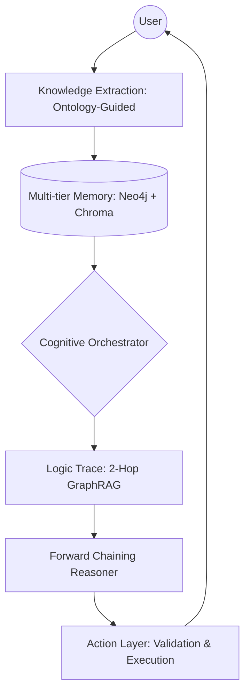

# 🛡️ Clawra: Kinetic Ontology-Driven Cognitive Engine

[](https://github.com/wu-xiaochen/AbilityBuilder-Agent/stargazers)
[](https://github.com/wu-xiaochen/AbilityBuilder-Agent/blob/main/LICENSE)
[](https://www.python.org/)

**Clawra** is a next-generation, neuro-symbolic framework for autonomous agents inspired by **Palantir Foundry’s Ontology**. It transforms static knowledge into a **Kinetic Decision-Making System** through formal logic, high-fidelity GraphRAG, and verifiable reasoning traces.

---

## 🏗️ Architecture: From Description to Action

Clawra separates the world into three distinct layers:
1.  **Object/Link Layer**: Entities and their relationships (The "What").
2.  **Logic Layer (Reasoning)**: Formal OWL rules and forward-chaining inference (The "Why").
3.  **Action Layer (Kinetic)**: Operational verbs that perform validations and drive decisions (The "How").



---

## 🌟 Key Innovations

-   **🧠 Palantir-style Action Layer**: Extends the ontology beyond static descriptions. Agents can execute formal `ActionTypes` (e.g., `ValidateQuality`, `OptimizeCompliance`) with built-in validation logic.
-   **🕸️ 2-Hop GraphRAG**: Enhances traditional RAG by performing vector retrieval followed by a **2-hop neighbor expansion** in the Knowledge Graph. This surfaces hidden "Quality Points" and safety requirements that LLMs typically miss.
-   **🛡️ Neuro-Symbolic Guardrails**: Every AI response is grounded in verified triples. The **Sentinel** contradiction checker prevents hallucinations by rejecting facts that violate ontological axioms.
-   **📽️ High-DPI Visual Reasoning**: A professional Streamlit dashboard featuring 200 DPI graph visualizations and a structured Reasoning Trace recorded for every decision.
-   **⚙️ Ontology-Guided Extraction**: A high-density extraction pipeline that uses domain-specific schemas to capture technical specs (e.g., 燃气调压箱, P1/P2 Pressures) with 95%+ fidelity.

---

## 🚀 Quick Start

### 1. Prerequisites
- Python 3.10+
- OpenAI API Key
- Neo4j (Optional, defaults to in-memory mode if not found)

### 2. Setup
```bash
git clone https://github.com/wu-xiaochen/AbilityBuilder-Agent.git
cd AbilityBuilder-Agent
pip install -r requirements.txt
```

### 3. Launch the Demo
```bash
streamlit run examples/streamlit_app.py
```

---

## 🛠️ Project Structure

-   `src/`: Core engine logic (Reasoner, Memory, Perception).
-   `examples/`: Production-ready Streamlit interface.
-   `docs/`: Deep-dive architecture and conceptual guides (Ontology vs KG).
-   `tests/`: Comprehensive unit tests for logic and extraction.
-   `legacy/`: Archived template files and research drafts.

---

## 🤝 Contributing

We welcome contributions to the neuro-symbolic future! See [CONTRIBUTING.md](CONTRIBUTING.md) for details.

## 📄 License

Clawra is licensed under the MIT License. See [LICENSE](LICENSE) for details.

---

<p align="center">
  Built with ❤️ for the future of Autonomous Intelligence.
</p>
