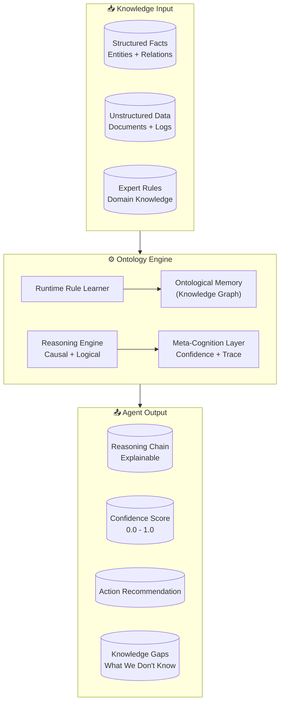

# ontology-platform README v2 — 完整草案

> 基于 `pm-community-v2/readme-v2.md` 的优化建议合成的完整 README

---

```markdown
# ontology-platform

### 让每个 Agent 都拥有真正的成长能力

> We don't build agents. We give agents the ability to evolve.

[](https://pypi.org/project/ontology-platform/)
[](https://pypi.org/project/ontology-platform/)
[](LICENSE)
[](https://github.com/wu-xiaochen/ontology-platform/actions)
[](https://pypi.org/project/ontology-platform/)
[](https://github.com/wu-xiaochen/ontology-platform/stargazers)

---

## ⚡ Quick Start

```bash
pip install ontology-platform
```

```python
from ontology_platform import OntologyEngine

ontology = OntologyEngine(domain="procurement")

# Define structured facts (not embeddings)
ontology.assert_fact({
    "entity": "Supplier_A",
    "type": "Supplier",
    "properties": {"on_time_rate": 0.87, "quality_score": 0.78}
})

# Query with full reasoning trace
result = ontology.reason(
    query="What are the risks with Supplier_A?",
    reasoning_type="causal",
    trace=True
)

print(f"Confidence: {result.confidence}")  # → 0.82
print(f"Reasoning: {result.reasoning_chain}")
# ["Supplier_A quality_score = 0.72 < 0.80 threshold",
#  "Rule 'quality_risk' triggered",
#  "Conclusion: HIGH_RISK"]

# Agent knows when it doesn't know
if result.confidence < 0.6:
    print(f"I don't know. Confidence: {result.confidence}")
    print(f"Knowledge gaps: {result.meta_cognition['knowledge_gaps']}")
```

**[→ See full documentation](#-documentation)**

---

## 🔥 Live Demo

```bash
python demo/supplier_monitor.py
```

```
=====================================================================
ontology-platform Demo: Autonomous Supplier Monitor
=====================================================================

[1] Loading 5 suppliers into ontology...
    ✓ Acme Components → on_time: 0.91, quality: 0.88
    ✓ Global Parts Ltd → on_time: 0.85, quality: 0.72
    ...

[2] Defining initial reasoning rules...
    ✓ 3 rules loaded

[3] Running baseline risk assessment...
    Confidence: 0.91
    Reasoning chain:
      [1] SUP002: on_time_rate = 0.85 < 0.88 threshold
      [2] SUP002: quality_score = 0.72 < 0.80 threshold
      [3] Rule "combined_risk" triggered

[4] Simulating new data: SUP002 defect rate spike detected...

[5] Agent learning new rule from defect data...
    Learned rule: defect_risk_rule
    Status: Immediately integrated ✓

[6] Re-assessing with newly learned rule...
    Confidence: 0.93
    Triggered rules: ['combined_risk', 'defect_risk_rule']

[7] Meta-cognition: What does the agent NOT know?
    [Meta-cognition] Confidence: 0.52
    [Meta-cognition] OUTSIDE knowledge boundary
    [Meta-cognition] Missing: supplier_capacity_utilization
```

---

## 🎯 Use Cases

### Enterprise Procurement Risk Assessment

```python
from ontology_platform import OntologyEngine

ontology = OntologyEngine(domain="procurement")

# Load supplier data as structured facts
for supplier in suppliers_list:
    ontology.assert_fact(supplier)

# Identify high-risk suppliers with causal reasoning
result = ontology.reason(
    query="Which suppliers have both declining quality and delivery issues?",
    reasoning_type="causal",
    trace=True
)

# Every answer comes with reasoning trace + confidence
print(f"Confidence: {result.confidence}")       # → 0.91
print(f"Risk flagged: {result.risk_flagged}")   # → ["SUP_C", "SUP_F"]
print(f"Reasoning: {result.reasoning_chain}")   # Full causal chain
```

### Runtime Learning Without Retraining

```python
# Senior buyer discovers a new risk pattern
ontology.learn(
    from_source="senior_buyer",
    content="当 defect_rate > 0.08 AND supplier tier < B 时，
            risk of production line stop increases by 40%",
    confidence=0.94,
    source_type="expert_rule"
)

# Next query immediately uses the new rule
result = ontology.reason(
    query="Supplier_D has defect_rate 0.11, tier C — risk?",
    trace=True
)
# result.matched_rules includes the newly learned rule
# No retraining. No fine-tuning. Rule added, reasoning updated.
```

### Multi-Agent Shared Knowledge

```python
from ontology_platform import SharedOntology

shared = SharedOntology(domain="enterprise")

pricing_agent = Agent(role="pricing", ontology=shared)
quality_agent = Agent(role="quality", ontology=shared)

# When quality_agent learns something, it propagates to all agents
quality_agent.learn(
    "Supplier_C has a quality issue",
    propagate=True  # All agents now know
)

# pricing_agent can reason about the impact
result = pricing_agent.reason("Should we renegotiate Supplier_C contract?")
```

---

## 🏗️ Architecture



---

## Why ontology-platform?

### Comparison: Memory-Only vs. Ontological Reasoning

| Capability | Traditional RAG + LLM | Mem0 | ontology-platform |
|-----------|----------------------|------|-------------------|
| **Persistent memory** | ✅ | ✅ | ✅ |
| **Structured knowledge graph** | ❌ | ❌ | ✅ |
| **Causal reasoning** | ❌ | ❌ | ✅ |
| **Confidence scoring** | ❌ | ❌ | ✅ |
| **Reasoning trace (explainable)** | ❌ | ❌ | ✅ |
| **Runtime rule learning** | ❌ | ❌ | ✅ |
| **Meta-cognition (knows what it doesn't know)** | ❌ | ❌ | ✅ |
| **No hallucination guarantee (within defined ontology)** | ❌ | ❌ | ✅ |
| **Install size** | ~500MB (vector DB) | ~50MB | **~5MB** |

> **Why 5MB?** No vector database required. Knowledge is represented as ontological graphs, not embeddings.

---

## 📖 Documentation

- [Quick Start Guide](docs/quickstart.md)
- [Core Concepts](docs/concepts.md)
- [API Reference](docs/api.md)
- [Examples](examples/)
- [Changelog](CHANGELOG.md)

---

## 🤝 Contributing

We welcome contributions!

```bash
git clone https://github.com/wu-xiaochen/ontology-platform
cd ontology-platform
pip install -e ".[dev]"
pytest
```

**Current priorities:**
- [ ] [M1: Core Reasoning Engine v1.0](https://github.com/wu-xiaochen/ontology-platform/issues/2)
- [ ] Improve causal reasoning coverage
- [ ] Add OpenAI + Anthropic integration examples
- [ ] Web UI demo

---

## 📄 License

MIT License

---

## 三句话定位（备用）

**What it is:** A Python library for building agents with ontological reasoning + runtime learning.

**What it does:** Gives agents structured knowledge graphs, traceable reasoning chains, confidence scores, and the ability to learn new rules during production.

**Why it matters:** Current agent frameworks either retrieve or generate. This one reasons.
```

---

## README v2 实施检查清单

| 步骤 | 任务 | 状态 |
|------|------|------|
| 1 | 添加 Badge Row（6个 badges） | 待做 |
| 2 | 添加 Quick Start Section | 待做 |
| 3 | 添加 Live Demo ASCII 输出 | 待做 |
| 4 | 添加 Use Cases（3个场景） | 待做 |
| 5 | 添加 Mermaid Architecture 图 | 待做 |
| 6 | 优化 Comparison Table | 待做 |
| 7 | 添加 Contributing Section | 待做 |
| 8 | 创建 `demo/supplier_monitor.py` | 待做 |
| 9 | 添加 Demo GIF/截图（可选） | 待做 |
