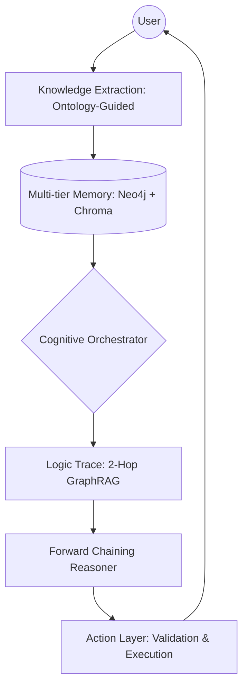

# 🧠 Clawra: Kinetic Ontology-Driven Cognitive Engine

[](https://github.com/wu-xiaochen/AbilityBuilder-Agent/stargazers)
[](https://github.com/wu-xiaochen/AbilityBuilder-Agent/blob/main/LICENSE)
[](https://www.python.org/)

**Clawra** is a production-grade, neuro-symbolic framework for autonomous agents inspired by **Palantir Foundry’s Ontology**. It transforms static knowledge into a **Kinetic Decision-Making System** through formal RDF/OWL logic, high-fidelity GraphRAG, and verifiable reasoning traces.

---

## 🏗️ Architecture: From Description to Action

Clawra separates the world into three distinct layers, ensuring that LLM reasoning is grounded in verifiable organizational logic:
1.  **Object/Link Layer**: Entities and their relationships (The "What").
2.  **Logic Layer (Reasoning)**: Formal OWL rules and forward-chaining inference (The "Why").
3.  **Action Layer (Kinetic)**: Operational verbs that perform validations and drive decisions (The "How").



---

## 🌟 Key Innovations

-   **🕸️ Interactive Kinetic Graph**: Powered by **Pyvis**, Clawra provides a real-time, draggable, and zoomable view of the local ontology. Explore deeply nested relationships and "maximize" the view for complex KG analysis.
-   **🛡️ Multi-Agent Safety Audit**: Features a dedicated **Auditor Agent** and **Sentinel** logic to intercept risky plans and prevent ontological contradictions before execution.
-   **📏 Grain Theory (粒度理论)**: Built-in statistical integrity checks for aggregation queries (GraphRAG). Automatically detects "Fan-traps" and logical cardinality risks to ensure data-driven decisions are mathematically sound.
-   **🧐 High-Fidelity Reasoning Trace**: Every decision is logged with 100% transparency. View metacognitive reflections, auditor decisions, and forward-chaining steps in a structured, professional dashboard.
-   **🛠️ Framework-First Design**: The `CognitiveOrchestrator` is fully decoupled from the UI. It can be integrated as a standalone engine for any Agentic workflow requiring formal reasoning and safety guardrails.
-   **🎭 Cognitive Control**: Real-time **Prompt Override** capabilities allow users to calibrate agent personas and logic depth dynamically.

---

## 🚀 Quick Start

### 1. Prerequisites
- Python 3.10+
- OpenAI API Key
- Neo4j (Optional, defaults to in-memory mode if not found)

### 2. Setup
```bash
git clone https://github.com/wu-xiaochen/AbilityBuilder-Agent.git
cd AbilityBuilder-Agent
pip install -r requirements.txt
```

### 3. Launch the Professional Console
```bash
streamlit run examples/streamlit_app.py
```

---

## 🛠️ Project Structure

-   `src/`: **Framework Core**. Decoupled modules for Reasoner, Memory, Perception, and Evolution.
-   `examples/`: **Production Interface**. The high-fidelity Streamlit console.
-   `docs/`: **Knowledge Base**. Architecture deep-dives and conceptual guides.
-   `tests/`: **Rigorous Validation**. Comprehensive test suite (15+ core integration tests).

---

## 📄 License

Clawra is licensed under the MIT License. Built with ❤️ for the future of **Autonomous Cognitive Intelligence**.
