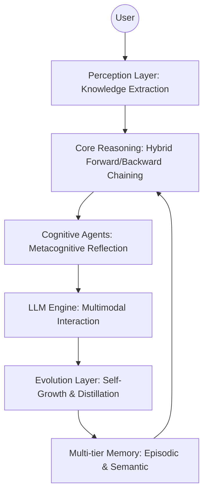

# 🛡️ Clawra: Cognitive Logical Agent with Reasoning & Autonomy

[](https://github.com/wu-xiaochen/AbilityBuilder-Agent/stargazers)
[](https://github.com/wu-xiaochen/AbilityBuilder-Agent/blob/main/LICENSE)
[](https://www.python.org/)

**Clawra** is a next-generation, neuro-symbolic framework for autonomous agents that eliminates LLM hallucinations through formal ontology-based reasoning. It enables agents to "think" with logical rigor and "grow" like a child through a self-evolving knowledge architecture.

> [!IMPORTANT]
> **Why Clawra?** While traditional LLM agents rely on probabilistic next-token generation, Clawra provides **symbolic guardrails**, ensuring that every decision is backed by formal logic and verifiable confidence.

---

## 🏗️ Architecture




---

## 🌟 Key Features

-   **🧠 Neuro-Symbolic Core**: Fuses the generative flexibility of LLMs with the deterministic precision of RDF/OWL logic.
-   **📈 Self-Evolving Ontology**: A "growing mind" that autonomously distills structured knowledge from every interaction.
-   **🛡️ Hallucination Guardrails**: Real-time logical verification that blocks inconsistent or groundless responses.
-   **🕵️ Metacognitive Perception**: Agents that "reflect" on their own reasoning paths before acting.
-   **📁 Multi-tier Memory**: Seamless management of Episodic (experience) and Semantic (knowledge) memory.

---

## 🚀 Quick Start

### Installation

```bash
pip install clawra
```

### Basic Usage: Logical Reasoning

```python
from clawra.core import Reasoner, Fact
from clawra.agents import MetacognitiveAgent

# 1. Initialize the Reasoning Brain
reasoner = Reasoner()
reasoner.add_rule_from_dict({
    "id": "risk_rule",
    "condition": "(?supplier has_quality_score ?score) AND (?score < 0.7)",
    "conclusion": "(?supplier status high_risk)"
})

# 2. Deploy a Metacognitive Agent
agent = MetacognitiveAgent(name="AuditBot", reasoner=reasoner)

# 3. Execute with Reflection
result = await agent.run("Evaluate SupplierA with score 0.65")
print(result) # Automatically verifies the risk based on ontology
```

---

## 🛠️ Roadmap

-   [x] **Module 1: Foundation** - Completed modular 8-layer architecture.
-   [x] **Module 2: Streaming** - Chunking strategy for large-scale knowledge bases.
-   [x] **Module 3: Evolution** - Self-learning and knowledge distillation interfaces.
-   [ ] **Module 4: UI** - Visual reasoning trace dashboard.

---

## 🤝 Contributing

We welcome contributions! See [CONTRIBUTING.md](CONTRIBUTING.md) for guidelines. Let's build the future of verifiable intelligence together.

## 📄 License

Clawra is licensed under the MIT License. See [LICENSE](LICENSE) for details.

---

<p align="center">
  Built with ❤️ for the future of Autonomous Intelligence.
</p>
