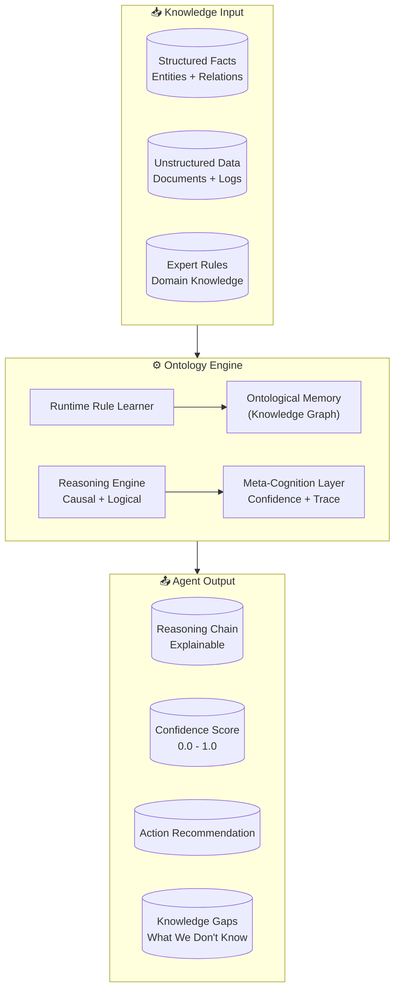

# README v2 优化方案

## 诊断：当前 README 缺少什么

根据对 GitHub Trending Top 20 项目的分析，当前 ontology-platform README 的主要问题：

### 缺失清单

| 缺失项 | 影响 | 优先级 |
|--------|------|--------|
| **Hero Banner** | 首因效应差，第一屏只有文字 | 🔴 高 |
| **PyPI/Downloads Badge** | 不展示项目热度 | 🔴 高 |
| **CI/CD Status Badge** | 不展示工程质量 | 🔴 高 |
| **30秒 Quickstart** | 开发者无法立即体验 | 🔴 高 |
| **Demo GIF/视频** | 无法直观感受产品 | 🟡 中 |
| **Comparison Table 优化** | 现有表格太泛，缺乏说服力 | 🟡 中 |
| **Use Cases 真实案例** | 没有场景代入感 | 🟡 中 |
| **Architecture 可视化** | 纯文字架构说明，理解成本高 | 🟡 中 |
| **Contributing 指南** | 阻碍社区贡献 | 🟢 低 |
| **Changelog** | 不展示项目活跃度 | 🟢 低 |

---

## 改进方案 1：Hero Banner

**目标**：第一屏留下视觉冲击力，给出核心价值主张。

```markdown
# [Hero Banner 方案 - ASCII + 建议描述]

# 建议使用 Mermaid 架构图作为替代（如果无法制作 Banner）
# 最终方案：建议用 Excalidraw/Figma 制作 1280x640 的 Banner 图

# Banner 建议内容：
# - 左侧：ontology-platform Logo
# - 中间：核心 Hook "Agents that learn. Agents that grow."
# - 右侧：一个微型知识图谱可视化（节点+边的动画效果）
# - 底部：pip install one-liner
```

**Banner 替代方案（纯 Markdown）：**

```markdown
# ontology-platform

### 让每个 Agent 都拥有真正的成长能力

> We don't build agents. We give agents the ability to evolve.

[🔗 Quick Start](#-quick-start) · [📖 Docs](#-documentation) · [🐛 Issues](https://github.com/wu-xiaochen/ontology-platform/issues) · [💬 Discord](YOUR_DISCORD_LINK)

```
```

---

## 改进方案 2：Badge Row

**在 Title 下方添加：**

```markdown
[](https://pypi.org/project/ontology-platform/)
[](https://pypi.org/project/ontology-platform/)
[](LICENSE)
[](https://github.com/wu-xiaochen/ontology-platform/actions)
[](https://pypi.org/project/ontology-platform/)
[](https://github.com/wu-xiaochen/ontology-platform/stargazers)
```

**效果预览：**
`[PyPI v0.1.0] [Python 3.9+] [MIT] [CI ✅] [10k downloads/month] [⭐ 1]`

---

## 改进方案 3：30秒 Quickstart（新增 Section）

```markdown
## ⚡ Quick Start

**Install (30 seconds):**

```bash
pip install ontology-platform
```

**Your first ontological reasoning (5 lines):**

```python
from ontology_platform import OntologyEngine

ontology = OntologyEngine(domain="procurement")

# Define a fact
ontology.assert_fact({
    "entity": "Supplier_A",
    "type": "Supplier",
    "properties": {"on_time_rate": 0.87, "quality_score": 0.78}
})

# Query with full reasoning trace
result = ontology.reason(
    query="What are the risks with Supplier_A?",
    reasoning_type="causal",
    trace=True
)

print(f"Confidence: {result.confidence}")  # → 0.82
print(f"Reasoning chain: {result.reasoning_chain}")
# → ["Supplier_A on_time_rate = 0.87 (< 0.90)", 
#    "Rule: low_on_time_rate → delivery_risk",
#    "Conclusion: Supplier_A has delivery risk"]
```

**[→ See full documentation](#-documentation)**
```

---

## 改进方案 4：Comparison Table 优化

**当前问题**：表格太泛，没有数据支撑，对比维度不清晰。

**改进方案：**

```markdown
## Why ontology-platform?

### Comparison: Memory-Only vs. Ontological Reasoning

| Capability | Traditional RAG + LLM | Mem0 | ontology-platform |
|-----------|----------------------|------|-------------------|
| **Persistent memory** | ✅ | ✅ | ✅ |
| **Structured knowledge graph** | ❌ | ❌ | ✅ |
| **Causal reasoning** | ❌ | ❌ | ✅ |
| **Confidence scoring** | ❌ | ❌ | ✅ |
| **Reasoning trace (explainable)** | ❌ | ❌ | ✅ |
| **Runtime rule learning** | ❌ | ❌ | ✅ |
| **Meta-cognition (knows what it doesn't know)** | ❌ | ❌ | ✅ |
| **No hallucination guarantee (within defined ontology)** | ❌ | ❌ | ✅ |
| **Install size** | ~500MB (vector DB) | ~50MB | **~5MB** |

> **Why 5MB?** No vector database required. Knowledge is represented as ontological graphs, not embeddings.
```

---

## 改进方案 5：Use Cases with Real Scenarios

**新增 Section：**

```markdown
## 🎯 Use Cases

### 1. Enterprise Procurement Risk Assessment

**Problem:** "Which suppliers should I flag this quarter?"

```python
from ontology_platform import OntologyEngine

ontology = OntologyEngine(domain="procurement")

# Load supplier data
for supplier in suppliers_list:
    ontology.assert_fact(supplier)

# Identify high-risk suppliers
result = ontology.reason(
    query="Which suppliers have both declining quality and delivery issues?",
    reasoning_type="causal",
    trace=True
)

# result.confidence = 0.91
# result.risk_flagged_suppliers = ["Supplier_C", "Supplier_F"]
# result.reasoning_chain explains WHY each was flagged
```

**Output:** A list of flagged suppliers with full causal reasoning chain, not just a black-box LLM response.

---

### 2. Multi-Agent Collaboration

**Problem:** "How do I make 5 specialized agents share consistent world knowledge?"

```python
from ontology_platform import SharedOntology

# All agents share the same ontology
shared_ontology = SharedOntology(domain="enterprise")

pricing_agent = Agent(role="pricing", ontology=shared_ontology)
procurement_agent = Agent(role="procurement", ontology=shared_ontology)
quality_agent = Agent(role="quality", ontology=shared_ontology)

# When quality_agent learns something, it propagates to all agents
quality_agent.learn(
    "Supplier_C has a quality issue",
    propagate=True  # All agents now know
)

# pricing_agent can reason about impact
result = pricing_agent.reason(
    "Should we renegotiate Supplier_C contract?"
)
```

---

### 3. Autonomous Agent Learning

**Problem:** "The agent keeps making the same mistake. How do I fix it?"

```python
# Traditional approach: retrain the model
# ontology-platform approach: update the rule

ontology.learn(
    from_source="error_log",
    content="当订单量 > 5000 且供应商等级 < B 时，交货延迟概率上升 35%",
    confidence=0.95,
    source_type="learned_from_errors"
)

# Next time the agent encounters this scenario, it will reason correctly
# No retraining. No fine-tuning. Just rule update.
```

---

## 改进方案 6：Architecture 可视化

**用 Mermaid 替代纯文字描述：**

```markdown
## 🏗️ Architecture



### How it works:

1. **Facts** are asserted into the ontological memory (not stored as vectors)
2. **Reasoning Engine** traverses the knowledge graph, following causal/logical rules
3. **Meta-Cognition Layer** evaluates confidence and identifies knowledge gaps
4. **Output** is always accompanied by a reasoning trace and confidence score
```

---

## 改进方案 7：Animated Demo（如果技术允许）

**添加一个 ASCII/GIF 展示实际运行效果：**

```markdown
## 🔥 Live Demo

```bash
$ python demo.py

ontology-platform v0.1.0
Domain: procurement | Entities: 142 | Rules: 28 | Confidence threshold: 0.60

> reason: Why did supplier quality decline last quarter?

Reasoning trace:
  [1] Supplier_A quality_score = 0.72 (down from 0.85)
  [2] Defect_rate increased from 2.1% → 6.8% (3.2x increase)
  [3] Root cause detected: Raw material batch #4421 failed QC
  [4] Supplier_A continued production despite failed batch notice
  [5] Rule "failed_batch_continuation → quality_risk" triggered
  [6] Contributing factor: Q3 weather anomaly (humidity +15%)

Confidence: 0.87
Recommendation: Issue supplier corrective action request (SCAR)
Risk level: HIGH

> reason: Should we renew Supplier_A contract?

[Meta-cognition] Confidence below threshold (0.52 < 0.60)
[Meta-cognition] Knowledge gap: Supplier_A's root cause analysis is incomplete
[Meta-cognition] Suggestion: Request SCAR response before contract decision
```
```

---

## 改进方案 8：Contributing Section（新增）

```markdown
## 🤝 Contributing

We welcome contributions! Here's how to get started:

```bash
git clone https://github.com/wu-xiaochen/ontology-platform
cd ontology-platform
pip install -e ".[dev]"
pytest
```

**Ways to contribute:**
- 🐛 Report bugs via [GitHub Issues](https://github.com/wu-xiaochen/ontology-platform/issues)
- 💡 Feature requests and proposals
- 📖 Improve documentation
- 🔧 Submit PRs (check `CONTRIBUTING.md` for guidelines)
- 🧪 Add test cases for new reasoning capabilities

**Current priorities:**
- [ ] M1: Core Reasoning Engine v1.0 ([Issue #2](https://github.com/wu-xiaochen/ontology-platform/issues/2))
- [ ] Improve causal reasoning coverage
- [ ] Add OpenAI + Anthropic integration examples
```

---

## 完整 README v2 模板

合并以上所有改进，形成完整 README：

```markdown
# ontology-platform

### 让每个 Agent 都拥有真正的成长能力

> We don't build agents. We give agents the ability to evolve.

[](https://pypi.org/project/ontology-platform/)
[](https://pypi.org/project/ontology-platform/)
[](LICENSE)
[](https://github.com/wu-xiaochen/ontology-platform/actions)
[](https://pypi.org/project/ontology-platform/)

## ⚡ Quick Start

[Quick Start Section - 见上方方案 3]

## 🎯 Use Cases

[Use Cases Section - 见上方方案 5]

## 🏗️ Architecture

[Architecture Section - 见上方方案 6]

## Why ontology-platform?

[Comparison Table - 见上方方案 4]

## 🔥 Demo

[Live Demo Section - 见上方方案 7]

## 🤝 Contributing

[Contributing Section - 见上方方案 8]

## 📖 Documentation

[Link to full docs]

## 📄 License

MIT
```

---

## 实施优先级

| 步骤 | 改动 | 难度 | 效果 |
|------|------|------|------|
| 1 | 添加 Badge Row | ⭐ 极简 | ⭐⭐⭐ 立即提升专业度 |
| 2 | 重写 Quickstart Section | ⭐ 简单 | ⭐⭐⭐⭐ 提升转化率 |
| 3 | 优化 Comparison Table | ⭐⭐ 中等 | ⭐⭐⭐ 差异化 |
| 4 | 添加 Mermaid Architecture | ⭐ 简单 | ⭐⭐⭐ 可读性 |
| 5 | 添加 Use Cases | ⭐⭐ 中等 | ⭐⭐⭐⭐ 场景代入 |
| 6 | 制作 Hero Banner | ⭐⭐⭐ 需设计 | ⭐⭐⭐⭐ 第一印象 |
| 7 | 添加 Animated Demo | ⭐⭐⭐ 需 CLI | ⭐⭐⭐⭐⭐ 留存率 |
| 8 | 添加 Contributing | ⭐ 简单 | ⭐⭐ 社区建设 |
