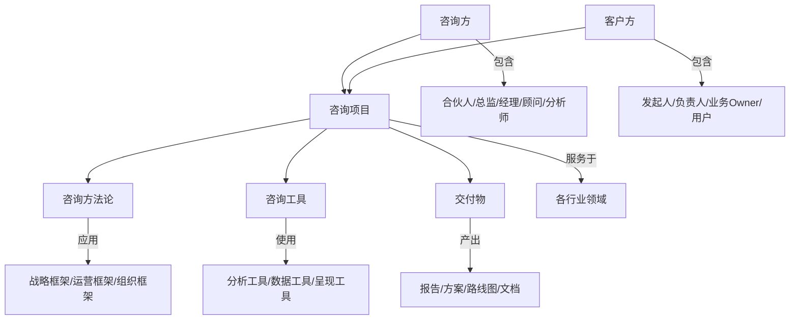

# 咨询领域本体 (Consulting Ontology)

> 版本: 2.0 | 创建日期: 2026-03-16 | 更新日期: 2026-03-16 | 领域: 管理咨询/战略咨询/IT咨询

---

## 1. 咨询类型 (Consulting Types)

### 1.1 按领域分类

| 类型 | 英文 | 描述 | 典型问题 |
|------|------|------|----------|
| 战略咨询 | Strategic Consulting | 企业长期发展方向、市场定位、竞争战略 | "我们应该进入哪些新市场？" |
| 管理咨询 | Management Consulting | 组织架构、流程优化、变革管理 | "如何提升组织效率？" |
| 运营咨询 | Operations Consulting | 供应链、生产制造、服务运营 | "如何优化供应链成本？" |
| 财务咨询 | Financial Consulting | 财务重组、并购咨询、风险管理 | "如何优化资本结构？" |
| 人力资源咨询 | HR Consulting | 人才战略、薪酬体系、组织发展 | "如何建立人才竞争力？" |
| IT咨询 | IT Consulting | 数字化转型、系统规划、技术架构 | "如何实现数字化转型？" |
| 市场营销咨询 | Marketing Consulting | 品牌策略、市场定位、渠道管理 | "如何提升品牌价值？" |
| 风险咨询 | Risk Consulting | 合规、内控、风险管理框架 | "如何防范运营风险？" |
| **数字化咨询** | Digital Consulting | 数字化战略、数据驱动业务 | "如何用AI赋能业务？" |
| **ESG咨询** | Sustainability Consulting | 可持续发展、碳中和、社会责任 | "如何实现碳中和目标？" |
| **AI与数据咨询** | AI & Data Consulting | AI应用、数据治理、算法落地 | "如何部署大语言模型？" |
| **组织发展咨询** | Organization Development | 组织文化、领导力、团队效能 | "如何打造学习型组织？" |

### 1.2 按服务模式分类

| 模式 | 英文 | 特征 | 适用场景 |
|------|------|------|----------|
| 常年顾问 | Retainer | 持续性月度/季度服务 | 长期战略伙伴关系 |
| 项目咨询 | Project | 限时交付具体项目 | 特定问题解决 |
| 转型咨询 | Transformation | 长期组织变革项目 | 全面变革需求 |
| 尽职调查 | Due Diligence | 投资/并购前评估 | 投资决策支持 |
| 培训与工作坊 | Training & Workshop | 能力建设、知识转移 | 团队能力提升 |
| 监管咨询 | Regulatory Advisory | 合规审查、政策解读 | 法规遵从需求 |
| 托管服务 | Managed Services | 持续运营支持 | 长期运营外包 |

### 1.3 按项目规模分类

- **战略级 (Strategy)**: CEO/董事会层面，跨年度，亿元级投入
- **运营级 (Operational)**: 业务单元层面，季度到年度，中等投入
- **职能级 (Functional)**: 部门层面，月度到季度，小规模投入
- **项目级 (Project)**: 特定项目，一次性交付

---

## 2. 咨询主体 (Consulting Actors)

### 2.1 咨询方

| 角色 | 英文 | 职责 | 典型产出 |
|------|------|------|----------|
| 合伙人 | Partner (P) | 客户关系、战略方向、质量把控 | 客户签约、战略决策 |
| 总监 | Director/Principal | 项目整体管理、业务开发 | 项目盈利、团队管理 |
| 经理 | Manager (EM/SM) | 团队领导、交付协调、客户对接 | 项目交付、客户满意 |
| 高级顾问 | Senior Consultant | 方案设计、复杂分析、团队指导 | 专业方案、质量把控 |
| 顾问 | Consultant (C) | 方案设计、分析研究、交付执行 | 具体 deliverables |
| 分析师 | Analyst (A) | 数据收集、基础分析、文档整理 | 数据洞察、文档产出 |
| 实习生 | Intern | 基础研究、信息整理 | 市场扫描、资料汇总 |

### 2.2 客户方

| 角色 | 英文 | 职责 |
|------|------|------|
| 项目发起人 | Sponsor | 项目授权、资源保障、政治支持 |
| 项目负责人 | Project Lead | 内部协调、需求传递、进度管理 |
| 业务负责人 | Business Owner | 业务需求、成果验收、业务价值 |
| 最终用户 | End User | 方案落地执行、使用反馈 |
| 决策委员会 | Steering Committee | 重大决策、跨部门协调 |
| 项目办公室 | PMO | 项目治理、进度监控 |

### 2.3 咨询公司类型

```
咨询公司生态
├── 战略咨询公司 (Strategy)
│   ├── McKinsey & Company
│   ├── Boston Consulting Group (BCG)
│   ├── Bain & Company
│   └── 精品战略咨询 (Boutique)
├── 管理咨询公司 (Management)
│   ├── Accenture
│   ├── Deloitte Consulting
│   ├── PwC Advisory
│   └── KPMG Advisory
├── IT咨询公司 (IT)
│   ├── IBM Consulting
│   ├── Capgemini
│   ├── Infosys
│   └── 数字化原生咨询
├── 行业垂直咨询
│   ├── 金融咨询公司
│   ├── 医疗健康咨询
│   └── 房地产咨询
└── 独立顾问 (Independent Consultant)
```

### 2.4 咨询团队结构

```
典型项目团队
┌────────────────────────────────────────┐
│           合伙人 (Partner)              │ ← 客户高层关系
├────────────────────────────────────────┤
│           总监 (Director)               │ ← 项目整体负责
├────────────────────────────────────────┤
│    经理 (Manager)    │   经理 (Manager) │ ← 多个工作流
├─────────────────────┼───────────────────┤
│  高级顾问           │   顾问             │
│  ├─ 顾问           │   ├─ 分析师        │
│  └─ 分析师         │   └─ 分析师        │
└────────────────────────────────────────┘
```

---

## 3. 咨询方法论 (Methodologies)

### 3.1 通用方法论

```
┌─────────────────────────────────────────────────────────────────────┐
│                        咨询项目生命周期                               │
├─────────────────────────────────────────────────────────────────────┤
│                                                                     │
│   ┌─────────┐    ┌─────────┐    ┌─────────┐    ┌─────────┐       │
│   │ 需求定义 │ → │ 现状诊断 │ → │ 方案设计 │ → │ 实施支持 │       │
│   │ Define  │    │ Diagnose│    │ Design  │    │Implement│       │
│   └─────────┘    └─────────┘    └─────────┘    └─────────┘       │
│        ↓              ↓              ↓              ↓              │
│   项目启动      分析研究        方案验证       持续优化           │
│   范围定义      根因分析        投资回报       知识转移           │
│                                                                     │
└─────────────────────────────────────────────────────────────────────┘

详细阶段:
1. 需求定义 (Define)
   ├── 利益相关者访谈
   ├── 业务目标对齐
   ├── 项目范围界定 (Scope)
   └── 工作说明书签署 (SOW)

2. 现状诊断 (Diagnose)
   ├── 业务现状分析
   ├── 痛点根因识别
   ├── 最佳实践对标
   └── 差距分析 (Gap Analysis)

3. 方案设计 (Design)
   ├── 解决方案构建
   ├── 商业模式设计
   ├── 实施路径规划
   └── 风险缓解策略

4. 实施支持 (Implement)
   ├── 变革管理
   ├── 培训与知识转移
   ├── 效果监测
   └── 持续优化建议
```

### 3.2 战略分析框架

| 框架 | 英文 | 适用场景 | 核心内容 |
|------|------|----------|----------|
| 波特五力 | Porter's Five Forces | 行业结构分析 | 供应商/买家/替代品/新进入者/竞争对手 |
| SWOT | SWOT Analysis | 战略规划 | 优势/劣势/机会/威胁 |
| BCG矩阵 | BCG Matrix | 投资组合 | 明星/现金牛/问题/瘦狗 |
| 价值链分析 | Value Chain Analysis | 竞争优势 | 基础活动/支持活动 |
| 3C分析 | 3C Analysis | 市场战略 | 公司/顾客/竞争对手 |
| 波特竞争战略 | Porter's Generic Strategies | 竞争定位 | 成本领先/差异化/集中化 |
| 颠覆性创新 | Disruptive Innovation | 新兴市场 | 低端颠覆/新市场颠覆 |
| 蓝海战略 | Blue Ocean Strategy | 市场创造 | 消除/减少/提升/创造 |

### 3.3 组织与流程框架

| 框架 | 英文 | 适用场景 |
|------|------|----------|
| 7S模型 | McKinsey 7S | 组织变革 |
| 业务流程再造 | BPR | 流程重塑 |
| 组织架构设计 | Organization Design | 结构优化 |
| 变革管理 | Change Management | 转型支持 |
| 精益转型 | Lean Transformation | 精益运营 |
| 六西格玛 | Six Sigma | 质量提升 |

### 3.4 数字化转型方法论

```
数字化转型框架
┌────────────────────────────────────────────────────────────┐
│                    数字化成熟度模型                          │
├────────────────────────────────────────────────────────────┤
│  Level 1: 初始级  →  Level 2: 基础级                       │
│  (Ad-hoc)          (Foundation)                           │
│                                                            │
│  Level 3: 发展级  →  Level 4: 优化级                       │
│  (Developing)      (Optimizing)                           │
│                                                            │
│  Level 5: 引领级  (Leading)                               │
└────────────────────────────────────────────────────────────┘

数字化转型关键维度:
├── 战略数字化 (Digital Strategy)
├── 业务数字化 (Digital Business)
├── 技术平台 (Technology Platform)
├── 数据能力 (Data Capability)
├── 组织敏捷 (Organizational Agility)
└── 数字化文化 (Digital Culture)
```

### 3.5 问题分析与解决

| 方法 | 英文 | 描述 |
|------|------|------|
| MECE | Mutually Exclusive, Collectively Exhaustive | 相互独立、完全穷尽 |
| 鱼骨图 | Fishbone Diagram | 根因分析 |
| 5 Why | Five Whys | 追问法 |
| 决策树 | Decision Tree | 决策分析 |
| 情景规划 | Scenario Planning | 未来情景 |
| 假设驱动 | Hypothesis-Driven | 假设验证 |

### 3.6 新兴方法论

- **Design Thinking**: 以人为本的设计思维
- **Agile/Scrum**: 敏捷方法论
- **OKR**: 目标与关键成果
- **Design Sprint**: 快速原型验证
- **Jobs-to-be-Done**: 客户需求洞察
- **Lean Startup**: 精益创业方法

---

## 4. 咨询工具 (Tools & Techniques)

### 4.1 分析工具

| 工具 | 英文 | 用途 |
|------|------|------|
| PEST分析 | PEST Analysis | 政治/经济/社会/技术环境 |
| 波特竞争五力 | Porter's Five Forces | 行业结构分析 |
| 价值链分析 | Value Chain Analysis | 竞争优势来源 |
| 业务流程图 | Business Process Mapping | 流程可视化 |
| 组织架构图 | Org Chart | 权责划分 |
| 利益相关者矩阵 | Stakeholder Matrix | 干系人分析 |
| 竞争者分析 | Competitive Analysis | 竞争格局 |
| 客户细分 | Customer Segmentation | 市场细分 |
| 用户旅程地图 | User Journey Map | 客户体验 |
| 情绪地图 | Empathy Map | 用户洞察 |

### 4.2 数据收集工具

| 工具 | 英文 | 适用场景 |
|------|------|----------|
| 深度访谈 | In-depth Interview | 定性洞察 |
| 问卷调查 | Survey | 定量分析 |
| 焦点小组 | Focus Group | 群体意见 |
| 文档审阅 | Document Review | 二手资料 |
| 现场观察 | Observation | 行为洞察 |
| 工作坊 | Workshop | 共创激发 |
| 数据分析 | Data Analysis | 趋势发现 |
| 竞品体验 | Competitive Teardown | 产品分析 |

### 4.3 数字化工具

```
咨询技术栈
├── 分析与可视化
│   ├── Excel / Google Sheets
│   ├── Tableau / Power BI
│   ├── Python / R
│   └── SQL
├── 协作与文档
│   ├── PowerPoint / Keynote
│   ├── Miro / Figma (白板协作)
│   ├── Notion / Confluence
│   └── Slack / Teams
├── 项目管理
│   ├── Jira / Asana
│   ├── Monday.com
│   └── Smartsheet
├── 数据收集
│   ├── Qualtrics / SurveyMonkey
│   ├── Typeform
│   └── Google Forms
└── AI辅助工具
    ├── Claude / ChatGPT (内容生成)
    ├── Perplexity / Arc Search (研究)
    ├── Beautiful.ai (PPT生成)
    └── GitHub Copilot (代码辅助)
```

### 4.4 呈现工具

| 工具 | 用途 |
|------|------|
| PPT演示 | 正式汇报 |
| 思维导图 (Mind Mapping) | 头脑风暴 |
| 甘特图 (Gantt Chart) | 项目进度 |
| 仪表盘 (Dashboards) | 数据监控 |
| 原型 (Prototypes) | 方案验证 |
| 视频/动画 | 生动演示 |
| 交互式报告 | 数字化交付 |

### 4.5 AI在咨询中的应用

```
AI辅助咨询场景
├── 研究与分析
│   ├── 文献综述自动化
│   ├── 竞品信息抓取
│   ├── 数据清洗与处理
│   └── 趋势分析
├── 内容生成
│   ├── PPT大纲生成
│   ├── 报告初稿撰写
│   ├── 邮件/沟通模板
│   └── 翻译与本地化
├── 创意激发
│   ├── 头脑风暴辅助
│   ├── 方案变体生成
│   └── 最佳实践建议
└── 效率提升
    ├── 会议纪要自动生成
    ├── 知识库问答
    └── 代码/脚本生成
```

---

## 5. 交付物 (Deliverables)

### 5.1 文档类

| 交付物 | 英文 | 描述 | 典型页数 |
|--------|------|------|----------|
| 项目章程 | Project Charter | 项目目标、范围、团队、里程碑 | 3-5页 |
| 现状诊断报告 | Current State Assessment | 业务现状、痛点、根因分析 | 20-40页 |
| 解决方案 | Solution Design | 详细设计方案 | 30-60页 |
| 实施路线图 | Roadmap | 分阶段计划、资源、风险 | 10-20页 |
| 最终汇报 | Final Presentation | 成果总结、建议 | 20-30页 |
| 战略规划报告 | Strategic Plan | 长期战略、目标、路径 | 40-80页 |
| 市场分析报告 | Market Analysis | 行业趋势、竞争、市场机会 | 30-50页 |
| 运营优化方案 | Operations Improvement | 流程优化、效率提升 | 20-40页 |
| 数字化战略 | Digital Strategy | 数字化转型规划 | 30-50页 |
| 可行性研究 | Feasibility Study | 投资评估、风险分析 | 20-40页 |

### 5.2 产物类

| 类型 | 描述 |
|------|------|
| 流程文档 | 流程图/SOP/操作手册 |
| 组织架构 | 调整方案/职责矩阵/RACI |
| 系统需求 | 功能需求/非功能需求 |
| 培训材料 | 培训课件/用户手册/视频 |
| 变革管理 | 沟通计划/培训计划/支持方案 |
| 数据分析 | 数据模型/仪表盘/报表 |
| 原型设计 | UI原型/交互原型 |

### 5.3 数字化交付物

```
新兴交付物形式
├── 交互式报告
│   ├── Web-based Dashboard
│   ├── 可点击PDF
│   └── 数据可视化故事
├── 数字工具
│   ├── Excel模型/计算器
│   ├── 决策支持系统
│   └── 移动端应用原型
├── 视频内容
│   ├── 方案演示视频
│   ├── 培训视频课程
│   └── 用户引导视频
└── 知识资产
    ├── 知识库/FAQ
    ├── 最佳实践库
    └── 模板与工具包
```

### 5.4 交付物质量标准

- **完整性**: 覆盖所有约定范围
- **专业性**: 格式规范、内容严谨
- **可读性**: 逻辑清晰、重点突出
- **可执行性**: 方案可落地实施
- **可衡量性**: 成果可量化评估

---

## 6. 咨询行业领域 (Industry Verticals)

```
咨询行业分布
├── 金融服务业 (Financial Services)
│   ├── 银行 (Commercial Bank)
│   ├── 投资银行 (Investment Bank)
│   ├── 保险 (Insurance)
│   ├── 资产管理 (Asset Management)
│   ├── 财富管理 (Wealth Management)
│   └── Fintech/数字金融
│
├── 制造业 (Manufacturing)
│   ├── 汽车 (Automotive)
│   ├── 高科技 (Hi-tech)
│   ├── 消费品 (Consumer Goods)
│   ├── 工业制造 (Industrial)
│   └── 工业4.0/智能制造
│
├── 医疗健康 (Healthcare)
│   ├── 制药 (Pharma)
│   ├── 医疗器械 (Medical Device)
│   ├── 医疗服务 (Healthcare Services)
│   ├── 生物技术 (Biotech)
│   └── 数字健康 (Digital Health)
│
├── 零售与消费品 (Retail & Consumer)
│   ├── 传统零售 (Traditional Retail)
│   ├── 电商 (E-commerce)
│   ├── 时尚与奢侈品 (Fashion & Luxury)
│   └── 品牌与营销
│
├── 科技与通信 (Technology & Telecom)
│   ├── 软件 (Software)
│   ├── 硬件 (Hardware)
│   ├── 通信 (Telecom)
│   ├── 云计算 (Cloud Computing)
│   ├── 人工智能 (AI)
│   └── 大数据与分析
│
├── 能源与公用事业 (Energy & Utilities)
│   ├── 传统能源 (Oil & Gas)
│   ├── 可再生能源 (Renewable Energy)
│   ├── 电力 (Power & Utilities)
│   └── 碳中和/ESG
│
├── 政府与公共部门 (Government & Public Sector)
│   ├── 智慧城市 (Smart City)
│   ├── 数字政府 (E-Government)
│   ├── 公共安全 (Public Safety)
│   └── 公共服务 (Public Services)
│
├── 房地产与建筑 (Real Estate & Construction)
│   ├── 房地产开发 (Real Estate Development)
│   ├── 商业地产 (Commercial Real Estate)
│   ├── 物业管理 (Property Management)
│   └── 智能建筑 (Smart Building)
│
├── 教育 (Education)
│   ├── 高等教育 (Higher Education)
│   ├── K-12教育
│   ├── 职业教育 (Vocational)
│   └── EdTech
│
├── 交通运输 (Transportation)
│   ├── 航空 (Aviation)
│   ├── 物流与供应链 (Logistics & Supply Chain)
│   ├── 航运 (Maritime)
│   └── 出行服务 (Mobility)
│
└── 媒体与娱乐 (Media & Entertainment)
    ├── 传统媒体 (Traditional Media)
    ├── 流媒体 (Streaming)
    ├── 游戏 (Gaming)
    └── 体育娱乐 (Sports & Entertainment)
```

### 6.1 行业咨询重点

| 行业 | 核心咨询主题 |
|------|--------------|
| 金融 | 数字化转型、风险管理、财富管理、监管合规 |
| 制造 | 智能制造、供应链优化、精益生产、可持续发展 |
| 医疗 | 数字化医疗、医改应对、创新药研发、患者体验 |
| 零售 | 全渠道、会员运营、供应链、品类管理 |
| 科技 | 产品战略、技术架构、云迁移、AI应用 |
| 能源 | 碳中和、能源转型、数字化、ESG |

---

## 7. 核心能力 (Competencies)

### 7.1 硬技能 (Hard Skills)

| 能力 | 英文 | 描述 | 优先级 |
|------|------|------|--------|
| 行业知识 | Industry Knowledge | 深度理解客户行业 | ⭐⭐⭐ |
| 分析能力 | Analytical Skills | 数据分析、逻辑推理 | ⭐⭐⭐ |
| 方案设计 | Solution Design | 定制化方案构建 | ⭐⭐⭐ |
| 项目管理 | Project Management | 计划、执行、交付 | ⭐⭐⭐ |
| 数据分析 | Data Analysis | 统计分析、机器学习 | ⭐⭐ |
| 工具应用 | Tool Proficiency | Python/SQL/Excel/PPT | ⭐⭐ |
| 财务管理 | Financial Analysis | 财务建模、估值 | ⭐⭐ |
| 技术架构 | Technology Architecture | 系统设计、技术选型 | ⭐⭐ |
| 变革管理 | Change Management | 组织变革实施 | ⭐⭐ |
| AI应用 | AI Application | AI工具辅助咨询 | ⭐⭐ |

### 7.2 软技能 (Soft Skills)

| 能力 | 英文 | 描述 |
|------|------|------|
| 沟通能力 | Communication | 口头/书面/演示 |
| 客户管理 | Client Management | 期望管理、关系维护 |
| 团队协作 | Teamwork | 跨团队合作 |
| 领导力 | Leadership | 带领团队、影响他人 |
| 解决问题 | Problem Solving | 系统性思维 |
| 适应能力 | Adaptability | 灵活应变 |
| 好奇心 | Curiosity | 持续学习 |
| 批判性思维 | Critical Thinking | 独立判断 |
| 情商 | Emotional Intelligence | 人际敏感度 |
| 时间管理 | Time Management | 高效优先级 |

### 7.3 咨询能力模型

```
咨询人才能力金字塔
              ⭐ 战略思维
             ⭐⭐
            ⭐⭐⭐  领导力
           ⭐⭐⭐⭐
          ⭐⭐⭐⭐⭐  专业技能
         ⭐⭐⭐⭐⭐⭐
        ⭐⭐⭐⭐⭐⭐⭐  基础能力
       ⭐⭐⭐⭐⭐⭐⭐⭐
      ⭐⭐⭐⭐⭐⭐⭐⭐⭐

基础能力: 沟通/分析/学习/执行
专业技能: 行业/方法/工具/交付
领导力: 团队/客户/变革
战略思维: 创新/全局/长期
```

### 7.4 职业发展路径

```
咨询职业阶梯
┌─────────────────────────────────────────┐
│           合伙人 (Partner)              │ 8-15年
├─────────────────────────────────────────┤
│           总监 (Director)               │ 6-10年
├─────────────────────────────────────────┤
│    高级经理 (Senior Manager)            │ 5-8年
├─────────────────────────────────────────┤
│    经理 (Manager)                       │ 3-5年
├─────────────────────────────────────────┤
│    高级顾问 (Senior Consultant)         │ 2-3年
├─────────────────────────────────────────┤
│    顾问 (Consultant)                    │ 1-2年
├─────────────────────────────────────────┤
│    分析师 (Analyst)                     │ 0-1年
└─────────────────────────────────────────┘
```

---

## 8. 质量标准 (Quality Standards)

### 8.1 项目质量维度

| 维度 | 英文 | 描述 |
|------|------|------|
| 相关性 | Relevance | 方案与业务目标匹配 |
| 可行性 | Feasibility | 方案可落地实施 |
| 创新性 | Innovation | 提供差异化价值 |
| 可持续性 | Sustainability | 长期效果保障 |
| 可衡量性 | Measurability | 成果可量化评估 |
| 专业性 | Professionalism | 文档规范、表达专业 |

### 8.2 质量保障流程

```
质量保障流程
┌──────────────┐    ┌──────────────┐    ┌──────────────┐    ┌──────────────┐
│  同行评审    │ →  │  客户评审    │ →  │  质量复核    │ →  │  最终验收    │
│ Peer Review  │    │Client Review│    │Quality Check│    │Final Approval│
└──────────────┘    └──────────────┘    └──────────────┘    └──────────────┘
     ↓                   ↓                   ↓                   ↓
  团队内检           客户确认           质量部门           正式签署
```

### 8.3 质量检查清单

- [ ] 内容完整性（覆盖所有约定范围）
- [ ] 逻辑一致性（论据支撑结论）
- [ ] 数据准确性（数据来源可靠）
- [ ] 格式规范性（模板/风格统一）
- [ ] 可执行性（方案可落地）
- [ ] 风险识别（潜在风险已评估）
- [ ] 价值呈现（商业价值明确）

---

## 9. 关系映射 (Relationship Map)



---

## 10. 附录：术语表

| 术语 | 英文 | 定义 |
|------|------|------|
| 工作说明书 | SOW (Statement of Work) | 项目范围和工作内容定义 |
| 关键假设 | Key Assumptions | 方案设计的基础假设 |
| 风险矩阵 | Risk Matrix | 风险概率与影响评估 |
| 变革管理 | Change Management | 组织变革的规划与实施 |
| 知识转移 | Knowledge Transfer | 技能和知识的传递过程 |
| 落地支持 | Implementation Support | 方案实施的辅助服务 |
| 基准对标 | Benchmarking | 与行业最佳实践比较 |
| 最佳实践 | Best Practices | 行业验证的有效方法 |

---

*本本体将持续迭代更新，以适应咨询行业发展*
