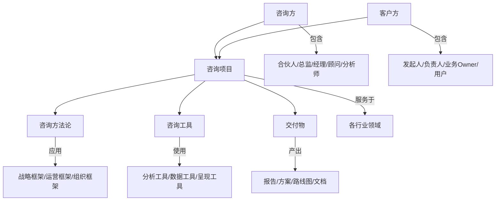

# 咨询领域本体 (Consulting Ontology)

> 版本: 1.0 | 创建日期: 2026-03-16 | 领域: 管理咨询/战略咨询/IT咨询

## 1. 咨询类型 (Consulting Types)

### 1.1 按领域分类

| 类型 | 英文 | 描述 |
|------|------|------|
| 战略咨询 | Strategic Consulting | 企业长期发展方向、市场定位、竞争战略 |
| 管理咨询 | Management Consulting | 组织架构、流程优化、变革管理 |
| 运营咨询 | Operations Consulting | 供应链、生产制造、服务运营 |
| 财务咨询 | Financial Consulting | 财务重组、并购咨询、风险管理 |
| 人力资源咨询 | HR Consulting | 人才战略、薪酬体系、组织发展 |
| IT咨询 | IT Consulting | 数字化转型、系统规划、技术架构 |
| 市场营销咨询 | Marketing Consulting | 品牌策略、市场定位、渠道管理 |
| 风险咨询 | Risk Consulting | 合规、内控、风险管理框架 |

### 1.2 按服务模式分类

- **常年顾问 (Retainer)**: 持续性月度/季度服务
- **项目咨询 (Project)**: 限时交付具体项目
- **转型咨询 (Transformation)**: 长期组织变革项目
- **尽职调查 (Due Diligence)**: 投资/并购前评估

---

## 2. 咨询主体 (Consulting Actors)

### 2.1 咨询方

| 角色 | 职责 |
|------|------|
| 合伙人 (Partner) | 客户关系、战略方向、质量把控 |
| 总监 (Director/Principal) | 项目整体管理、业务开发 |
| 经理 (Manager) | 团队领导、交付协调、客户对接 |
| 顾问 (Consultant) | 方案设计、分析研究、交付执行 |
| 分析师 (Analyst) | 数据收集、基础分析、文档整理 |

### 2.2 客户方

| 角色 | 职责 |
|------|------|
| 项目发起人 (Sponsor) | 项目授权、资源保障 |
| 项目负责人 (Project Lead) | 内部协调、需求传递 |
| 业务负责人 (Business Owner) | 业务需求、成果验收 |
| 最终用户 (End User) | 方案落地执行 |

---

## 3. 咨询方法论 (Methodologies)

### 3.1 通用方法论

```
┌─────────────────────────────────────────────────────────┐
│                    咨询项目生命周期                       │
├─────────────────────────────────────────────────────────┤
│  1. 需求定义 → 2. 现状诊断 → 3. 方案设计 → 4. 实施支持  │
│                                                         │
│  Define    →  Diagnose    →  Design    →  Implement    │
└─────────────────────────────────────────────────────────┘
```

### 3.2 经典框架

| 框架 | 适用领域 | 核心内容 |
|------|----------|----------|
| 波特五力 | 战略分析 | 供应商/买家/替代品/新进入者/竞争对手 |
| SWOT | 战略规划 | 优势/劣势/机会/威胁 |
| BCG矩阵 | 战略投资 | 明星/现金牛/问题/瘦狗 |
| 价值链分析 | 运营优化 | 基础活动/支持活动 |
| 7S模型 | 组织变革 | 战略/结构/制度/风格/人员/技能/共享价值观 |
| 业务流程再造 | 流程优化 | 重新设计核心流程 |
| MECE | 问题分析 | 相互独立、完全穷尽 |

---

## 4. 咨询工具 (Tools & Techniques)

### 4.1 分析工具

- **PEST分析**: 政治/经济/社会/技术环境
- **波特竞争五力**: 行业结构分析
- **价值链分析**: 竞争优势来源
- **业务流程图**: 流程可视化
- **组织架构图**: 权责划分
- **利益相关者矩阵**: 干系人分析

### 4.2 数据收集工具

- 访谈 (Interviews)
- 问卷调查 (Surveys)
- 焦点小组 (Focus Groups)
- 文档审阅 (Document Review)
- 观察 (Observation)
- 数据分析 (Data Analysis)

### 4.3 呈现工具

- PPT演示
- 思维导图 (Mind Mapping)
- 甘特图 (Gantt Chart)
- 仪表盘 (Dashboards)
- 原型 (Prototypes)

---

## 5. 交付物 (Deliverables)

### 5.1 文档类

| 交付物 | 描述 |
|--------|------|
| 项目章程 (Project Charter) | 项目目标、范围、团队 |
| 现状诊断报告 (Current State Assessment) | 问题根因分析 |
| 解决方案 (Solution Design) | 详细设计方案 |
| 实施路线图 (Roadmap) | 分阶段计划 |
| 最终汇报 (Final Presentation) | 成果总结 |

### 5.2 产物类

- 流程文档/操作手册
- 组织架构调整方案
- 系统需求规格说明
- 培训材料
- 变革管理计划

---

## 6. 咨询行业领域 (Industry Verticals)

```
咨询行业分布
├── 金融服务业 (Financial Services)
│   ├── 银行、保险、资产管理
│   └── Fintech/数字金融
├── 制造业 (Manufacturing)
│   ├── 汽车、高科技、消费品
│   └── 工业4.0/智能制造
├── 医疗健康 (Healthcare)
│   ├── 制药、医疗器械、医疗服务
│   └── 数字健康
├── 零售与消费品 (Retail & Consumer)
│   ├── 传统零售、电商
│   └── 品牌与营销
├── 科技与通信 (Technology & Telecom)
│   ├── 软件、硬件、通信
│   └── 云计算/AI/大数据
├── 能源与公用事业 (Energy & Utilities)
│   ├── 传统能源、可再生能源
│   └── 碳中和/ESG
├── 政府与公共部门 (Government & Public Sector)
│   └── 智慧城市/数字政府
└── 其他行业
```

---

## 7. 核心能力 (Competencies)

### 7.1 硬技能 (Hard Skills)

- 行业知识 (Industry Knowledge)
- 分析能力 (Analytical Skills)
- 方案设计 (Solution Design)
- 项目管理 (Project Management)
- 数据分析 (Data Analysis)
- 工具应用 (Tool Proficiency)

### 7.2 软技能 (Soft Skills)

- 沟通能力 (Communication)
- 客户管理 (Client Management)
- 团队协作 (Teamwork)
- 领导力 (Leadership)
- 解决问题 (Problem Solving)
- 适应能力 (Adaptability)

---

## 8. 质量标准 (Quality Standards)

### 8.1 项目质量维度

- **相关性**: 方案与业务目标匹配
- **可行性**: 方案可落地实施
- **创新性**: 提供差异化价值
- **可持续性**: 长期效果保障
- **可衡量性**: 成果可量化评估

### 8.2 质量保障流程

```
同行评审 (Peer Review) → 客户评审 (Client Review) → 
质量复核 (Quality Check) → 最终验收 (Final Approval)
```

---

## 9. 关系映射 (Relationship Map)



---

## 10. 附录：术语表

| 术语 | 英文 | 定义 |
|------|------|------|
| 工作说明书 | SOW (Statement of Work) | 项目范围和工作内容定义 |
| 关键假设 | Key Assumptions | 方案设计的基础假设 |
| 风险矩阵 | Risk Matrix | 风险概率与影响评估 |
| 变革管理 | Change Management | 组织变革的规划与实施 |
| 知识转移 | Knowledge Transfer | 技能和知识的传递过程 |
| 落地支持 | Implementation Support | 方案实施的辅助服务 |
| 基准对标 | Benchmarking | 与行业最佳实践比较 |
| 最佳实践 | Best Practices | 行业验证的有效方法 |

---

*本本体将持续迭代更新，以适应咨询行业发展*
